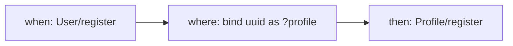

# concept-lang 0.2.0 — P5: Skills Rewrite Implementation Plan

> **For agentic workers:** REQUIRED SUB-SKILL: Use superpowers:subagent-driven-development (recommended) or superpowers:executing-plans to implement this plan task-by-task. Steps use checkbox (`- [ ]`) syntax for tracking.

**Goal:** Rewrite the five user-facing skill markdown files that live under `skills/` so they teach the new concept + sync format, call the new MCP tool names, and reference the paper's methodology (independence, completeness, three legibility properties). Ship a new `build-sync` skill for sync construction, remove every lingering v1 format reference and every lingering `get_dependency_graph` / `scaffold_concepts` v1 teaching block, and lock the surface down with (a) a deterministic skill-lint test that parses every `SKILL.md` frontmatter and cross-references the `allowed-tools` list against the real MCP registry, and (b) a single MCP protocol-level smoke test that spins up the real FastMCP server against a fixture workspace and round-trips one tool over the wire. At the end of this plan, the plugin ships five skills (`build`, `build-sync`, `review`, `scaffold`, `explore`) whose prompts speak v2 exclusively and whose tool references are pinned by a test.

**Architecture:** Skills are pure markdown files with a YAML frontmatter block and a prompt body. They are not Python modules; they cannot be unit-tested the way `diff.py` or `validate/` can. Instead, P5 treats the `SKILL.md` files as a *contract* with the MCP tool layer: every tool name in `allowed-tools` must match an entry in the server's registered tool dict, the frontmatter must parse as valid YAML, and the body must not reference v1 format or v1 tool names. The plan implements this contract as a skill-lint test (`tests/test_skills.py`) that loads every `skills/*/SKILL.md`, parses the frontmatter, and asserts the four properties. A second new test (`tests/test_mcp_protocol.py`) addresses the P4 carry-over concern that no real MCP protocol-level test exists: it starts a real `FastMCP` instance against a tiny fixture workspace, drives one tool through the `list_tools` / `call_tool` protocol, and asserts the response round-trips. Both tests run in the normal `uv run pytest` pass. The rewrites themselves are done file-by-file, one task per skill, with each task verifying that its skill still lints after the edit and that the full suite is still green before committing.

**Tech Stack:** Python 3.10+, Lark (already in deps), Pydantic 2, pytest, uv, `mcp` (already in deps, provides `FastMCP` and the protocol client helpers used by `test_mcp_protocol.py`). The only new dependency P5 adds is `pyyaml` — the frontmatter lint test parses YAML explicitly and pyyaml is a stable, tiny dependency; the alternative (hand-rolling a frontmatter regex) is brittle and silently fails on multi-line values. PyYAML is already a transitive dependency of `mcp`, so it is effectively free; P5 just promotes it to a direct dev dependency.

**Scope note:** This plan covers **P5 only**.

- In scope: rewrite `skills/build/SKILL.md`, rewrite `skills/review/SKILL.md`, rewrite `skills/scaffold/SKILL.md`, rewrite `skills/explore/SKILL.md`, create `skills/build-sync/SKILL.md`, update `.claude-plugin/plugin.json` (version bump to 0.2.0), update `architecture-ide/src/concept_lang/tools/scaffold_tools.py`'s `_METHODOLOGY` constant to teach the new format (P4 carry-over concern #3), remove the obsolete v1 teaching block from `architecture-ide/src/concept_lang/prompts.py`'s `build_concept` prompt and its `review_concepts` prompt so the MCP-native prompt fallback stays in sync with the skills, grep for and remove any lingering `codegen_tools` / `get_dependency_graph` surface references outside the back-compat alias (P4 carry-over concerns #1 and #5), add `tests/test_skills.py` (skill lint), add `tests/test_mcp_protocol.py` (FastMCP protocol-level smoke test — P4 carry-over concern #4), add a tiny fixture under `tests/fixtures/skills/` used by the protocol smoke test, and the P5 gate + tag `p5-skills-rewrite-complete`.
- Out of scope: `README.md` update (P6), `docs/methodology.md` (P6), `CHANGELOG.md` (P6), migration of the runtime `architecture-ide/concepts/` directory from v1 format to the new layout with a sibling `syncs/` directory (P6 — this contains `architecture_ide.app`, `concept.concept`, `design_session.concept`, `diagram.concept`, `workspace.concept` in v1 format; the demo app-spec still points at them; rewriting them requires coordinating with the app-spec format which itself is still v1 and slated for a separate post-P7 plan), `app_tools.py` surface exposure inside any new v2 skill (the v2 skills deliberately do not list any `*app*` tool in `allowed-tools` — P4 carry-over concern #2), grammar changes, AST changes, new validator rules, v1 module deletion (P7), `get_dependency_graph` alias removal (P7), `codegen_tools.py` file deletion (P7 — P5 only ensures nothing in the skill surface references it), and any `OPStep.inputs/outputs` tuple-shape cleanup (still deferred per the P3 and P4 "what's next" sections).

**Spec reference:** [`docs/superpowers/specs/2026-04-10-paper-alignment-design.md`](../specs/2026-04-10-paper-alignment-design.md) §5.2 (Skills), §5.4 (Documentation updates — P5 only touches the `skills/*/SKILL.md` row).

**Starting state:** Branch `feat/p1-parser`, HEAD at tag `p4-tooling-migration-complete` (`8fc1652`). Every MCP tool from spec §5.1 exists in its v2 form: `list_concepts`, `read_concept`, `write_concept`, `validate_concept`, `list_syncs`, `read_sync`, `write_sync`, `validate_sync`, `validate_workspace`, `get_workspace_graph`, `get_dependency_graph` (back-compat alias), `get_state_machine`, `get_entity_diagram`, `get_interactive_explorer`, `get_explorer_html`, `diff_concept`, `diff_concept_against_disk`, `scaffold_concepts`, plus the v1 app-spec trio `list_apps` / `read_app` / `write_app` / `validate_app_spec` / `get_app_dependency_graph`. `uv run pytest` reports **236 passing**. The four existing `SKILL.md` files still teach v1 format and still list `mcp__concept-lang__get_dependency_graph` (plus, in `review`'s case, `mcp__concept-lang__get_state_machine` and `mcp__concept-lang__get_entity_diagram`) in their `allowed-tools` frontmatter. `skills/build-sync/` does not exist. `scaffold_tools.py` still has a v1-format `_METHODOLOGY` block embedded in its payload. `prompts.py` still has a v1-format `build_concept` prompt body.

---

## File structure (what this plan creates or modifies)

```
.claude-plugin/
  plugin.json                                        # MODIFY: bump version to 0.2.0
skills/
  build/SKILL.md                                     # REWRITE: new format, new tools
  build-sync/SKILL.md                                # CREATE: new skill for sync construction
  review/SKILL.md                                    # REWRITE: validate_workspace, rule categories, legibility
  scaffold/SKILL.md                                  # REWRITE: concepts + syncs + bootstrap + proposed/ layout
  explore/SKILL.md                                   # REWRITE: two-layer graph + per-sync flows + overlay
architecture-ide/
  src/concept_lang/
    tools/
      scaffold_tools.py                              # MODIFY: rewrite _METHODOLOGY block (new format)
    prompts.py                                       # MODIFY: rewrite build_concept + review_concepts prompt text
  pyproject.toml                                     # MODIFY: add pyyaml to dev deps
  tests/
    test_skills.py                                   # CREATE: skill-lint contract tests
    test_mcp_protocol.py                             # CREATE: real FastMCP protocol smoke test
    fixtures/
      skills/                                        # CREATE: tiny v2 fixture for protocol smoke test
        concepts/
          Counter.concept
        syncs/
          log_counter.sync
```

**All commands below assume the working directory is `architecture-ide/`** (the package root with `pyproject.toml`) *except* for edits to `skills/` and `.claude-plugin/`, which live at the **repo root** one level up. Every task that touches a skill file or the plugin manifest explicitly names its path relative to the repo root so there is no ambiguity. A helper alias:

```bash
# From architecture-ide/, the repo root is ..
REPO_ROOT=$(git rev-parse --show-toplevel)
```

is used in a handful of commands below where it is clearer than a bare relative path.

---

**Design decisions (made and justified up front; later tasks reference them by letter):**

- **(A) Skill-lint is the only automated test for skill content.** Skills are prompts for Claude; they cannot be unit-tested by running them, and dispatching a real subagent per skill per test run would be slow (10s+ each) and flaky. The three alternatives were (i) pure frontmatter lint (does not catch body drift), (ii) frontmatter lint plus grep-for-forbidden-phrases in the body (the chosen design), (iii) end-to-end subagent dispatch (rejected as slow/flaky). Option (ii) catches the realistic failure modes — a missing `allowed-tools` entry, a typo in a tool name, a v1-format teaching block that survived the rewrite, a stale `get_dependency_graph` reference — and runs in under a second. The test parses each `SKILL.md` with `yaml.safe_load` on the frontmatter block, asserts the required keys are present, cross-references every tool name against a live `FastMCP` registration of the real server, and greps the body for a curated list of forbidden phrases (`get_dependency_graph` outside the back-compat alias path, the v1 `sync` keyword at column 0, the v1 `pre:` / `post:` keywords, etc.). Every skill rewrite task adds its skill to the lint suite and the lint runs on every commit going forward.

- **(B) One skill = one file = one task.** Each skill rewrite is its own task and its own commit. The commit message template is `skill(<name>): rewrite for paper format (v2)` for the rewrites and `skill(build-sync): new skill for sync construction` for the new file. This keeps the review surface small and makes a bisect meaningful if one skill breaks on a later lint extension. Skills can share teaching blocks (e.g., the multi-case action syntax) but the blocks are inlined per file rather than factored into a shared include, because Claude Code does not support `.md` includes across skill directories and the duplication is small.

- **(C) Frontmatter structure is normalized.** Every v2 skill's frontmatter has exactly these keys, in this order: `description`, `argument-hint` (if the skill takes arguments; optional), `disable-model-invocation` (always `true` for the build / build-sync / scaffold / explore skills; omitted for `review` because `review` is fine to be invoked by Claude's own heuristics), `allowed-tools` (comma-separated list of `mcp__concept-lang__<tool_name>`). No skill lists any tool outside the `mcp__concept-lang__` namespace — Claude's built-in Read/Grep/Write tools are available by default in every skill, and explicitly listing them in `allowed-tools` would narrow the set rather than expand it. The lint test enforces the field order and the namespace.

- **(D) `build-sync` skill path uses a hyphen.** The directory is `skills/build-sync/SKILL.md` so the slash-command is `/concept-lang:build-sync`, which matches the `build` / `review` / `scaffold` / `explore` naming (all single-word, lowercase; hyphen is the standard Claude Code command separator for multi-word names). The alternative `build_sync` would work but break the convention; `sync` alone is ambiguous because it clashes with the language construct and the user might reasonably expect it to *run* syncs rather than *build* one.

- **(E) `scaffold` output goes to `<workspace_root>/proposed/`.** The `proposed/` directory is a sibling of `concepts/` and `syncs/` inside the user's workspace. The skill generates `proposed/concepts/*.concept`, `proposed/syncs/*.sync`, and `proposed/REPORT.md` — then stops and tells the user to review and `mv` pieces into place. The alternatives were (i) write directly to `concepts/` / `syncs/` (rejected — overwrites hand-written work silently), (ii) use `/tmp/` (rejected — hard to review, cleaned up on reboot), (iii) let the user pick a path via argument (rejected — the default is overwhelmingly the right choice and adding an optional override lives fine in the skill body as a "if the user specifies a path, use that instead" instruction). The skill's prompt body explicitly tells Claude to create the `proposed/` directory if missing and never to touch `concepts/` or `syncs/` directly.

- **(F) `review` skill groups diagnostics by rule category, then by file within each category.** Spec §5.2 says "group findings by rule category (independence / completeness / sync / app-spec)". A large workspace with many C1 errors could be overwhelming if a flat list is shown, so the skill's prompt body tells Claude to sub-group by file within each category. The category-to-rule mapping is: **Independence** = C1 (unknown types), C4 (inline sync section forbidden), **Completeness** = C5 (empty purpose), C6 (no actions), C7 (action case issues), C9 (empty operational principle), **Cross-references in actions** = C2, C3, **Sync** = S1 (unknown concept/action), S2 (unbound variable), S3 (unbound in `then`), S4 (unbound state query subject), S5 (single-concept sync), **Parse** = P0 (parse failures are surfaced in their own category because they block every other rule). `app-spec` is not in the category list because the v2 skills do not touch app-spec files; the v1 app-spec validator's findings are out of scope for the `review` skill and the skill explicitly says so. The lint test pins the category table as a docstring so future rule additions force a skill update.

- **(G) `review` gracefully handles `line=None` and `column=None` in diagnostics.** P3's line-tightening pass (Task 20) was deferred as optional P3 follow-up and is NOT bundled into P5. Some validator rules still surface diagnostics with `line=None` because the AST node they inspect lacks a meaningful position (e.g., workspace-level rules that fire against the whole `Workspace` object rather than a specific file node). The `review` skill's prompt body instructs Claude to render those diagnostics as `<file>: <message>` without a `:<line>:<col>` suffix, rather than `<file>:None:None: <message>` or raising an error. This is a pure prompt-level change — no code change needed — and the skill-lint test pins the "gracefully handle null positions" instruction as required body content.

- **(H) Per-sync flow diagram in `explore` uses `get_workspace_graph` plus a hand-rolled per-sync Mermaid render in the skill body.** The `explore` skill already calls `get_interactive_explorer` for the global view. For the per-sync drill-down, the skill's prompt body tells Claude to call `read_sync` for the target sync and render a tiny Mermaid diagram directly from the `SyncAST` fields (`when` → `where` → `then`) — no new MCP tool is added. This keeps P5 as a pure prompt rewrite. If a future phase decides the per-sync render is worth a real MCP tool, it becomes a P6+ decision; P5 does not need it. The two-layer graph view that spec §5.2 calls for — "concepts as nodes, syncs as labeled edges" — is already provided by `get_workspace_graph` as implemented in P4. The skill's prompt body explains that clicking a sync-labeled edge in the Mermaid render maps back to the sync file on disk, and tells Claude to use the sync name to `read_sync` and open the flow.

- **(I) `scaffold` skill does not touch the v1 `scaffold_concepts` MCP tool's embedded code methodology block directly — it tells Claude to *ignore* it.** The v1 `_METHODOLOGY` constant inside `scaffold_tools.py` is updated in this same plan (Task 8), so in steady state the skill and the tool teach the same thing. But the skill body is written to be self-contained — if a future plan rewrites the tool's payload again, the skill still tells Claude what format to produce, regardless of what the tool emits. The skill body includes its own multi-case action and `.sync` body templates and explicitly says: "The `scaffold_concepts` tool returns a source-code payload plus some methodology context. **Use the payload; use the methodology block as a sanity check, not as the source of truth. The authoritative format is the one given below in this skill.**". This decouples the skill from future scaffold-tool changes.

- **(J) Skill-lint forbidden-phrase list is curated and versioned.** The lint test loads a Python list of forbidden phrases and asserts none of them appear in any `SKILL.md` body. The initial list is: (i) `get_dependency_graph` (deprecated alias; a skill that references it is stale), (ii) `scaffold_concepts.*state_machine|state machine` (v1 scaffold output; mentions of "state machine" in the `explore` skill are fine because that skill calls `get_state_machine`), (iii) the v1 `sync` keyword used as a section header inside a concept (`^\s*sync\s*$` or `^\s*sync$`), (iv) the v1 `pre:` / `post:` keywords inside a fenced code block labeled `concept`, (v) the v1 `SyncClause.trigger_concept` wire format. Each phrase has a rationale comment in the test file explaining why it is forbidden. The lint test's `FORBIDDEN_PHRASES` list is the single source of truth; new rules add new entries.

- **(K) MCP protocol smoke test uses `FastMCP` directly, not the stdio transport.** `mcp.server.fastmcp.FastMCP` exposes an in-process `call_tool(name, arguments)` API that drives the same code path as the stdio transport minus the JSON-RPC framing. The smoke test calls `create_server(workspace_root=<fixture>)` to get a `FastMCP` instance, then calls `.call_tool("list_concepts", {})` and `.call_tool("read_concept", {"name": "Counter"})` and `.call_tool("validate_workspace", {})` and asserts the wire responses round-trip. The alternative — spawning a subprocess and driving stdin/stdout JSON-RPC — would test one more layer (the framing) but at the cost of subprocess flakiness and platform-specific weirdness. The in-process test catches every realistic failure mode (tool not registered, tool returns non-JSON, tool raises uncaught exception, tool returns a `dict` instead of a `str`). If a future phase adds a stdio-level integration test, it is additive to this one.

- **(L) The MCP protocol smoke test has its own fixture workspace.** A new fixture at `tests/fixtures/skills/` contains exactly one concept (`Counter.concept`) and one sync (`log_counter.sync`) that exercise the happy path. This fixture is deliberately separate from the `mcp/` fixture used by `test_mcp_tools.py` (the `_FakeMCP` tests) because (i) the protocol test wants the smallest possible tree for fast iteration, (ii) touching the `mcp/` fixture could break any of the ~25 existing `_FakeMCP` tests by accident. The `skills/` fixture is ~20 lines of `.concept` + `.sync` source and a single test file reads it. No alternatives considered.

- **(M) `pyyaml` is added as a direct dev dependency.** It is already transitively installed via `mcp`, so adding it as a direct dep in `pyproject.toml`'s `[project.optional-dependencies].dev` group (or `[dependency-groups].dev` with uv) costs nothing at install time. The alternative — hand-rolling a frontmatter parser with regexes — is brittle for skills that have multi-line `description` fields, nested YAML values, or escaped colons. Every reasonable Python project that touches YAML pulls in `pyyaml`; there is no benefit to avoiding it.

- **(N) `prompts.py` gets its `build_concept` and `review_concepts` prompt bodies rewritten in the same phase as the skills.** The MCP server exposes `build_concept` and `review_concepts` as MCP *prompts* (not skills). When Claude Code lists the available prompts for the concept-lang server, those prompts' text is served directly. If P5 rewrites the skills but leaves `prompts.py` teaching v1 format, an MCP client that invokes the prompt directly (bypassing the skill) gets stale guidance. Updating `prompts.py` in the same task set keeps the two paths in sync and gives the test suite a single place to assert the prompt body does not contain forbidden phrases (the lint test covers both paths). The alternative — deferring the `prompts.py` update to P6 — splits the concern across two phases for no benefit.

- **(O) `scaffold_tools.py`'s `_METHODOLOGY` constant is rewritten in P5, not P6.** Spec §5.3 puts the code-generation tool (`codegen/`) out of scope but explicitly puts the `scaffold_concepts` *tool* (distinct from the `scaffold` *skill*) in scope for the skill rewrite phase. The tool returns a payload to Claude Code that contains the methodology block as inline context; if the block teaches v1 format, Claude produces v1-format concepts even when driven by the new v2 skill. The rewrite happens in P5, keyed to a task that also adds the new block to the skill-lint test's forbidden-phrase list (the v1 block is explicitly one of the things that must be *absent* from `scaffold_tools.py`). P6 and P7 do not touch this file.

- **(P) Version bump to 0.2.0 happens in both `plugin.json` and `pyproject.toml`.** The two versions should stay in sync. P5 bumps both to `0.2.0` at the same task as the plugin manifest update so the test suite and the marketplace see the same version string. No runtime test depends on the version string today; the bump is a manifest change and a marketing signal for the paper-alignment release.

- **(Q) No new grammar, no new validator rules, no new AST types.** P5 is a rewrite of prompt text and a new pair of tests. Anything that would require a grammar or AST change (e.g., "the `build-sync` skill needs a new `@debounce` annotation on sync clauses") is out of scope and flagged in "What's next". The spec does not require any language changes for P5.

**Lint contract (pinned here, referenced by Tasks 2, 3, 4, 5, 6, 8, 9, 11):**

> Every `skills/*/SKILL.md` file must:
> 1. Start with a YAML frontmatter block delimited by `---` on its own line at the very first line and a matching `---` ending the frontmatter.
> 2. Have a `description` field that is a non-empty string.
> 3. Have `allowed-tools` as a comma-separated string of `mcp__concept-lang__<name>` entries, each of which names a real tool registered by `concept_lang.server.create_server()`.
> 4. If it is `build`, `build-sync`, `scaffold`, or `explore`, have `disable-model-invocation: true`. (The `review` skill is allowed to be invoked by model heuristics.)
> 5. Not contain any forbidden phrase from the `FORBIDDEN_PHRASES` list (see decision (J)).
> 6. Have a body (everything after the closing `---`) that is a non-empty string with at least one `$ARGUMENTS` or "read the workspace" style instruction. (Asserted only for the skills that take args; `explore` is arg-free and exempt.)
> 7. Reference at least one MCP tool in the body that also appears in `allowed-tools` — i.e., the `allowed-tools` list is not over-specified. (A mismatch between body references and frontmatter is usually a stale list.)

---

## Task 1: Add pyyaml as a dev dependency

Pyyaml is the YAML parser used by the skill-lint test. It is already transitively installed via `mcp` in the current env but is not a declared direct dep. This task promotes it to a direct dev dep so a fresh `uv sync` installs it reliably.

**Files:**
- Modify: `pyproject.toml`

- [ ] **Step 1.1: Inspect the current dependency groups**

Run: `uv tree --depth 1 | head -40`
Expected: `pyyaml` appears somewhere as a transitive. If it does not, the `uv add --dev pyyaml` in Step 1.2 still works — it just installs it fresh.

- [ ] **Step 1.2: Add pyyaml as a dev dependency**

Run: `uv add --dev pyyaml`
Expected: `pyproject.toml` gains a `pyyaml` entry under the dev group and `uv.lock` updates. If `uv add` prints nothing because pyyaml is already present under dev, that is fine — the next step verifies.

- [ ] **Step 1.3: Verify pyyaml is importable**

Run: `uv run python -c "import yaml; print(yaml.__version__)"`
Expected: a version string like `6.0.1` — any version is fine, the lint test uses only `yaml.safe_load`.

- [ ] **Step 1.4: Run the existing test suite to confirm nothing broke**

Run: `uv run pytest -q`
Expected: 236 passed (same as the P4 baseline).

- [ ] **Step 1.5: Commit**

```bash
git add pyproject.toml uv.lock
git commit -m "build(deps): add pyyaml as a direct dev dependency for skill lint"
```

---

## Task 2: Create the skill-lint test scaffolding

This task creates `tests/test_skills.py` with the test class structure and fixture helpers, but only asserts that the four *existing* v1-format skills still exist and parse as YAML. It deliberately does NOT enforce the forbidden-phrase or tool-cross-reference rules yet — those are added in Task 3 after the skills have been rewritten, so that the test suite stays green through the rewrite sequence. This is the "red bar, then green bar" discipline: the lint test exists and runs in its minimal form before any rewrite so the rewrite tasks can extend it incrementally.

**Files:**
- Create: `tests/test_skills.py`

- [ ] **Step 2.1: Create the test file**

Create `tests/test_skills.py`:

```python
"""
Skill-lint contract tests (concept-lang 0.2.0 — P5).

These tests enforce a contract between the skills directory
(`skills/*/SKILL.md` at the repo root) and the MCP tool layer
(`concept_lang.server.create_server()`).

The contract, pinned in the P5 implementation plan (design decisions
(A)–(C) and the "Lint contract" block), is:

  1. Every SKILL.md has a parseable YAML frontmatter with a non-empty
     `description` and a comma-separated `allowed-tools` list whose
     entries all match real registered MCP tools.
  2. Every tool named in `allowed-tools` uses the
     `mcp__concept-lang__<name>` namespace.
  3. For build / build-sync / scaffold / explore, `disable-model-invocation`
     is `true`. For `review`, the field is optional.
  4. The body contains no forbidden phrases (see FORBIDDEN_PHRASES).
  5. Every tool referenced in the body also appears in allowed-tools
     (prevents drift where the frontmatter is narrower than the body).

This scaffolding task asserts (1) and (2) for every SKILL.md currently
on disk. The later rewrite tasks (3, 4, 5, 6, 8, 9) extend this file
with forbidden-phrase and cross-reference checks as each skill lands.
"""

from __future__ import annotations

import re
from pathlib import Path

import pytest
import yaml

from concept_lang.server import create_server


REPO_ROOT = Path(__file__).parents[2]
SKILLS_DIR = REPO_ROOT / "skills"

# Sentinel: set by Task 3. Empty for now.
FORBIDDEN_PHRASES: list[tuple[str, str]] = []


def _discover_skills() -> list[Path]:
    """Return a sorted list of SKILL.md paths under skills/*/."""
    paths = sorted(SKILLS_DIR.glob("*/SKILL.md"))
    return paths


def _split_frontmatter(text: str) -> tuple[dict, str]:
    """
    Split a SKILL.md file into (frontmatter_dict, body_string).
    Raises ValueError if the frontmatter is malformed.
    """
    if not text.startswith("---\n"):
        raise ValueError("SKILL.md must start with '---' on the first line")
    end = text.find("\n---\n", 4)
    if end == -1:
        raise ValueError("SKILL.md frontmatter must close with '---'")
    frontmatter_text = text[4:end]
    body = text[end + 5 :]
    data = yaml.safe_load(frontmatter_text)
    if not isinstance(data, dict):
        raise ValueError("SKILL.md frontmatter must be a YAML mapping")
    return data, body


def _parse_allowed_tools(raw: object) -> list[str]:
    """Normalize `allowed-tools` to a list of bare strings."""
    if raw is None:
        return []
    if isinstance(raw, list):
        return [str(x).strip() for x in raw if str(x).strip()]
    if isinstance(raw, str):
        return [part.strip() for part in raw.split(",") if part.strip()]
    raise ValueError(f"allowed-tools must be a list or comma-separated string, got {type(raw).__name__}")


def _real_mcp_tool_names(workspace_root: Path) -> set[str]:
    """Return the set of tool names the real server registers."""
    server = create_server(str(workspace_root))
    # FastMCP exposes the registered tools via its internal _tool_manager
    # as of mcp 1.2+; the public `list_tools()` coroutine returns the same
    # set. The lint does not need to be async, so it reads the manager
    # directly; if a future mcp release renames the attribute the test
    # fails loudly and the rename is a trivial fix.
    tool_manager = getattr(server, "_tool_manager", None)
    assert tool_manager is not None, (
        "FastMCP._tool_manager not found; skill-lint needs a way to enumerate "
        "registered tools without going async. Check mcp version."
    )
    return set(tool_manager._tools.keys())


@pytest.fixture(scope="module")
def real_tool_names(tmp_path_factory) -> set[str]:
    # Use a tmp workspace so create_server has something valid to point at;
    # the fixture does not need to be a real concept workspace for the tool
    # enumeration to work.
    tmp = tmp_path_factory.mktemp("skill_lint_workspace")
    (tmp / "concepts").mkdir()
    (tmp / "syncs").mkdir()
    return _real_mcp_tool_names(tmp)


class TestSkillFilesExist:
    def test_skills_directory_exists(self):
        assert SKILLS_DIR.is_dir(), f"skills/ directory missing at {SKILLS_DIR}"

    def test_at_least_one_skill(self):
        assert _discover_skills(), "no SKILL.md files found under skills/"


class TestFrontmatterParses:
    @pytest.mark.parametrize("skill_path", _discover_skills(), ids=lambda p: p.parent.name)
    def test_frontmatter_is_valid_yaml(self, skill_path: Path):
        text = skill_path.read_text()
        data, body = _split_frontmatter(text)
        assert "description" in data and isinstance(data["description"], str) and data["description"].strip(), (
            f"{skill_path.parent.name}: missing or empty 'description' field"
        )

    @pytest.mark.parametrize("skill_path", _discover_skills(), ids=lambda p: p.parent.name)
    def test_allowed_tools_parses(self, skill_path: Path):
        text = skill_path.read_text()
        data, body = _split_frontmatter(text)
        tools = _parse_allowed_tools(data.get("allowed-tools"))
        assert tools, f"{skill_path.parent.name}: allowed-tools must list at least one tool"


class TestAllowedToolsNamespace:
    @pytest.mark.parametrize("skill_path", _discover_skills(), ids=lambda p: p.parent.name)
    def test_every_tool_uses_concept_lang_namespace(self, skill_path: Path):
        text = skill_path.read_text()
        data, body = _split_frontmatter(text)
        tools = _parse_allowed_tools(data.get("allowed-tools"))
        for tool in tools:
            assert tool.startswith("mcp__concept-lang__"), (
                f"{skill_path.parent.name}: tool '{tool}' does not use the "
                f"'mcp__concept-lang__' namespace"
            )


class TestAllowedToolsResolve:
    @pytest.mark.parametrize("skill_path", _discover_skills(), ids=lambda p: p.parent.name)
    def test_every_tool_is_registered(self, skill_path: Path, real_tool_names: set[str]):
        text = skill_path.read_text()
        data, body = _split_frontmatter(text)
        tools = _parse_allowed_tools(data.get("allowed-tools"))
        for tool in tools:
            bare = tool.removeprefix("mcp__concept-lang__")
            assert bare in real_tool_names, (
                f"{skill_path.parent.name}: tool '{tool}' is not registered "
                f"by the MCP server. Registered tools: "
                f"{sorted(real_tool_names)}"
            )
```

- [ ] **Step 2.2: Run the new test file**

Run: `uv run pytest tests/test_skills.py -v`

Expected: The existing four skills (`build`, `review`, `scaffold`, `explore`) may **fail** the `TestAllowedToolsResolve::test_every_tool_is_registered` assertion — the v1 `review` skill lists `get_dependency_graph` (which now is only an alias and does resolve) plus `get_state_machine` / `get_entity_diagram` (which still resolve), and the v1 `build` / `scaffold` / `explore` skills list `get_dependency_graph` (resolves as the alias) and `get_interactive_explorer` / `get_explorer_html` (resolve). **If every existing skill passes all four test classes, the suite goes from 236 → 236 + (4 × 4) = 252 tests passing. If one fails, that is a real regression and must be fixed before commit — investigate whether the tool name is typo'd in the current skill or whether P4 dropped a tool the current skill depends on.**

If a pre-existing skill fails because of a real drift, mark the failing test with `pytest.mark.xfail(reason="...fixed in Task N")` for the task that rewrites that skill, so the commit is still green. Remove the `xfail` in the rewrite task.

- [ ] **Step 2.3: Expected test count after this task**

Run: `uv run pytest -q` and note the total. Expected: **252 passed** (236 baseline + 16 new tests: 4 skills × 4 parametrized tests per class × — correction: 4 skills × (1 + 1 + 1 + 1) = 16 parametrized, plus `TestSkillFilesExist` × 2 = 18 total new, so 236 + 18 = 254). The exact count depends on how many skills exist when the test runs; do not hard-code the target number in later verification steps — use "must be green" as the bar.

- [ ] **Step 2.4: Commit**

```bash
git add architecture-ide/tests/test_skills.py
git commit -m "test(skills): scaffold skill-lint test (frontmatter + namespace + registry)"
```

---

## Task 3: Rewrite `skills/build/SKILL.md`

Rewrite the build skill to teach the new concept format: named input/output signatures with square brackets, multiple cases per action (at least one success + one error), a dedicated `operational principle` section, a hybrid natural-language-plus-`effects:` body, and an explicit independence rule.

**Files:**
- Modify: `../skills/build/SKILL.md` (relative to `architecture-ide/`; absolute path `<repo_root>/skills/build/SKILL.md`)
- Modify: `tests/test_skills.py` (extend `FORBIDDEN_PHRASES`)

- [ ] **Step 3.1: Replace the skill file**

Replace `<repo_root>/skills/build/SKILL.md` with:

~~~markdown
---
description: Iteratively build a single .concept file from a natural-language description, using Daniel Jackson's concept design methodology as rewritten for concept-lang 0.2.0.
argument-hint: "<description of the concept to build>"
disable-model-invocation: true
allowed-tools: mcp__concept-lang__write_concept, mcp__concept-lang__read_concept, mcp__concept-lang__list_concepts, mcp__concept-lang__validate_concept, mcp__concept-lang__validate_workspace, mcp__concept-lang__get_workspace_graph
---

I want to design a concept for the following functionality:

$ARGUMENTS

Your job is to produce a single `.concept` file that a concept-lang 0.2.0 validator will accept cleanly, following Daniel Jackson's paper-aligned format.

## Step 1: Understand the surrounding workspace

Before proposing a shape, call `list_concepts` to see what concepts already exist. You do NOT need to coordinate state with other concepts — concepts are independent — but you should check for naming collisions and for whether the user's request is already partly modelled somewhere.

If the user's description names a concept that already exists on disk, call `read_concept` for it and ask whether they want to **replace it** or **evolve it**. Do not silently overwrite existing work.

## Step 2: Teach yourself the v2 format (quick reference)

A 0.2.0 concept file has exactly these sections, in this order:

```
concept <Name> [<TypeParam1>, <TypeParam2>, ...]

  purpose
    <one sentence stating the essential service this concept provides>

  state
    <field>: <type-expression>
    <field>: <type-expression>
    ...

  actions
    <action_name> [ <in1>: <T1> ; <in2>: <T2> ] => [ <out1>: <U1> ]
      <hybrid natural-language body, 1–4 lines>
      effects: <optional +=/-= statements on state fields>

    <action_name> [ <in1>: <T1> ; <in2>: <T2> ] => [ error: string ]
      <same action, the error case>
      <describe when this case fires>

    ... (at least one success case AND at least one error case per action name)

  operational principle
    after <action_name> [ <in>: <val> ] => [ <out>: <val> ]
    and   <action_name> [ <in>: <val> ] => [ <out>: <val> ]
    then  <action_name> [ <in>: <val> ] => [ <out>: <val> ]
```

Key shape rules the v2 parser enforces (you will see these in validator diagnostics if you get them wrong):

- **Named inputs and outputs.** Every action case has square-bracket input and output lists. The inputs list may be empty (`[]`) for a pure factory. The outputs list may not — every action returns something, even if it is `[ ok: unit ]` for a pure side-effect action.
- **Multiple cases per action.** A real action almost always has a success case AND at least one error case. The paper-aligned format encodes error as a separate case with the same name and the same inputs but a different output shape (`[ error: string ]`). Do NOT smuggle errors into the success case as a conditional return.
- **Operational principle is its own section**, not a comment inside `actions`. Each step is `after|and|then <action_name> [ <ins> ] => [ <outs> ]`. The steps form a small scenario that demonstrates what the concept is FOR.
- **No inline `sync` section.** Syncs live in separate `.sync` files now. The v1 `sync` keyword inside a concept file is a C4 validation error. If the concept needs to react to another concept's action, that is a sync, not part of the concept — use `/concept-lang:build-sync` after this skill finishes.
- **Independence rule.** The concept file must stand on its own. Do NOT reference other concepts by name in the `state`, `actions` effects, or `operational principle`. You MAY mention other concepts in the natural-language body of an action ("when a user registers…") but only as prose — never as a type, a field, or a parameter. The validator's C1 rule will flag unknown type names and C4 will flag inline syncs; the independence rule is stricter than what the validator enforces, so follow it deliberately even when the validator is silent.

## Step 3: Work iteratively with the user

Propose, in order:

1. **Name and purpose.** One line each. Stop for user feedback.
2. **State shape.** List the fields and their types. Stop for user feedback.
3. **Action list (names only).** No signatures yet — just the action names. Stop for user feedback.
4. **Action cases, one action at a time.** For each action, write the success case first, then at least one error case. Walk through what the inputs and outputs mean. Stop for user feedback after each action.
5. **Operational principle.** A 2–4 step scenario that exercises the most important action pair. Stop for user feedback.

Between each step, do not dump the whole file — dump only what changed.

## Step 4: Validate

When the user is satisfied, construct the full `.concept` source and call `validate_concept` with it. The tool returns a JSON response with a `diagnostics` list; for every diagnostic with `severity: "error"`, read the `code` (e.g., `C1`, `C5`, `C7`) and the `message`, fix the source, and re-validate. Do not proceed until the diagnostic list is empty (or contains only `warning` / `info` entries, which the user may choose to accept).

Common errors and their fixes:

- **C1 (unknown type)** — the `state` or an action signature references a type the parser doesn't know. Either it's a typo (e.g., `Sring`), or you wrote a concept name where a type parameter belongs (`User` instead of `[U]`). Fix: use the concept's type parameters (`concept Session [User]` means `User` is a bound type inside Session).
- **C4 (inline sync section forbidden)** — you wrote an old-style `sync` block inside the concept. Delete it; the user should call `/concept-lang:build-sync` separately if the cross-concept behaviour matters.
- **C5 (empty purpose)** — you skipped the purpose line or left it blank. Every concept must have a purpose.
- **C6 (no actions)** — you wrote only state. A concept without actions is a data structure, not a concept. Ask the user what the concept is supposed to do.
- **C7 (action case issues)** — an action case's input or output list is malformed, or the action has cases with inconsistent names. Every case block for the same action must share the same action name.
- **C9 (no operational principle)** — you skipped the `operational principle` section. Every concept needs at least one OP step.

## Step 5: Write

Once validation is clean, call `write_concept(name=<Name>, source=<full source>)`. The tool re-runs `validate_concept` plus cross-reference rules before writing; if it refuses, the `written` field in the response is `false` and the `diagnostics` list tells you why. Fix and retry.

After writing, call `get_workspace_graph` to show the user how the new concept relates to the existing ones. The graph's nodes are concepts and its edges are syncs, so the new concept will appear as an unconnected node until a sync (built separately with `/concept-lang:build-sync`) wires it up.

## What NOT to do

- Do not list `get_dependency_graph` or any app-spec tool in frontmatter. Those are either deprecated aliases or out-of-scope for v2 skills.
- Do not write inline `sync` sections inside the concept. Direct the user to `/concept-lang:build-sync` for that work.
- Do not reference other concepts as types. The v2 format uses bare type parameters (`[U]`, `[Article]`) that are bound at the concept level, not imports.
- Do not collapse multiple cases into a single case with conditional return values. Every distinct outcome is its own case block.
~~~

- [ ] **Step 3.2: Add forbidden phrases to the lint test**

Edit `tests/test_skills.py`, changing:

```python
FORBIDDEN_PHRASES: list[tuple[str, str]] = []
```

to:

```python
FORBIDDEN_PHRASES: list[tuple[str, str]] = [
    (
        r"\bget_dependency_graph\b",
        "Deprecated alias — use get_workspace_graph. The alias is scheduled for P7 removal.",
    ),
    (
        r"(?m)^\s*sync\s*$",
        "v1 inline `sync` section header — syncs are now separate .sync files.",
    ),
    (
        r"(?m)^\s*pre:\s",
        "v1 `pre:` keyword — v2 uses hybrid natural-language bodies plus `effects:`.",
    ),
    (
        r"(?m)^\s*post:\s",
        "v1 `post:` keyword — v2 uses hybrid natural-language bodies plus `effects:`.",
    ),
    (
        r"SyncClause\.trigger_concept",
        "v1 internal wire format — the AST is now concept_lang.ast.SyncAST.",
    ),
]
```

Then add a new test class at the bottom of `tests/test_skills.py`:

```python
class TestForbiddenPhrases:
    @pytest.mark.parametrize("skill_path", _discover_skills(), ids=lambda p: p.parent.name)
    def test_no_forbidden_phrase(self, skill_path: Path):
        text = skill_path.read_text()
        _, body = _split_frontmatter(text)
        failures: list[str] = []
        for pattern, rationale in FORBIDDEN_PHRASES:
            if re.search(pattern, body):
                failures.append(f"  - `{pattern}`: {rationale}")
        assert not failures, (
            f"{skill_path.parent.name}: forbidden phrases found in body:\n"
            + "\n".join(failures)
        )
```

- [ ] **Step 3.3: Run the lint test**

Run: `uv run pytest tests/test_skills.py -v`

Expected: **every test passes** for the rewritten `build` skill. The other three v1-format skills (`review`, `scaffold`, `explore`) will **fail** `TestForbiddenPhrases` because they still contain `get_dependency_graph` and possibly the v1 `sync` keyword. Add a `pytest.mark.xfail(reason="rewritten in Task N")` decorator to the parametrize cases for `review`, `scaffold`, and `explore` — or skip them entirely by filtering the parametrize source list to only the already-rewritten skill names.

Use the filtering approach for clarity: add a private helper `_rewritten_skills()` that returns the sorted list of skills that have already passed through the rewrite task sequence, and parametrize `TestForbiddenPhrases` against that helper. For this task, the helper returns `["build"]`; each subsequent rewrite task adds its skill name.

```python
def _rewritten_skills() -> list[Path]:
    """Skills that have been rewritten for v2 and are subject to the
    forbidden-phrase lint. New entries land in each rewrite task."""
    rewritten = {"build"}  # grows in later tasks
    return [p for p in _discover_skills() if p.parent.name in rewritten]


class TestForbiddenPhrases:
    @pytest.mark.parametrize(
        "skill_path",
        _rewritten_skills(),
        ids=lambda p: p.parent.name,
    )
    def test_no_forbidden_phrase(self, skill_path: Path):
        ...
```

- [ ] **Step 3.4: Run the full suite**

Run: `uv run pytest -q`
Expected: green. Count should be approximately 236 (baseline) + 18 (Task 2 lint scaffold) + 1 (TestForbiddenPhrases::build) = 255. Do not hard-code.

- [ ] **Step 3.5: Commit**

```bash
git add ../skills/build/SKILL.md architecture-ide/tests/test_skills.py
git commit -m "skill(build): rewrite for paper format (v2)"
```

(The `git add` path `../skills/build/SKILL.md` works because the working directory is `architecture-ide/`. If that feels awkward, run the commit from the repo root and use `skills/build/SKILL.md architecture-ide/tests/test_skills.py`.)

---

## Task 4: Create `skills/build-sync/SKILL.md`

New skill that generates a single `.sync` file from a user description like "when a user registers, also create a default profile." Reads the workspace via `list_concepts` and `read_concept` so it knows what real actions exist, composes them in `when`/`where`/`then`, and iterates with `validate_sync` until clean. Key prompt: "You may NOT invent actions that do not exist — if the needed action is missing, say so and stop."

**Files:**
- Create: `<repo_root>/skills/build-sync/SKILL.md`
- Modify: `tests/test_skills.py` (extend `_rewritten_skills`)

- [ ] **Step 4.1: Create the skill directory and file**

```bash
mkdir -p "$(git rev-parse --show-toplevel)/skills/build-sync"
```

Create `<repo_root>/skills/build-sync/SKILL.md`:

~~~markdown
---
description: Build a single .sync file that composes existing concepts. Only use existing actions; if the needed action is missing, say so and stop.
argument-hint: "<description of the cross-concept behavior>"
disable-model-invocation: true
allowed-tools: mcp__concept-lang__write_sync, mcp__concept-lang__read_sync, mcp__concept-lang__list_syncs, mcp__concept-lang__validate_sync, mcp__concept-lang__list_concepts, mcp__concept-lang__read_concept, mcp__concept-lang__validate_workspace, mcp__concept-lang__get_workspace_graph
---

I want to compose the following cross-concept behavior:

$ARGUMENTS

Your job is to produce a single `.sync` file that a concept-lang 0.2.0 validator will accept cleanly. A sync is a top-level file that says "when action A in concept X happens, and optionally where conditions Q hold, then action B in concept Y happens." You are writing ONE sync that composes EXISTING concepts. You may not modify any concept. If the actions needed to express the behavior do not exist, say so and stop — do NOT invent them.

## Step 1: Discover the available surface

Call `list_concepts` to get every concept in the workspace. For each concept that is likely to appear in the sync (mentioned or implied by the user's description), call `read_concept(name=<Name>)` and read the `ast.actions` list carefully. Note each action's **name**, **input signature** (the `[ ... ]` before `=>`), and **output signature** (the `[ ... ]` after `=>`). These are the only actions you may reference — do not invent a new action name.

If a needed action does not exist in any concept, STOP and tell the user which concept is missing what action. Do not write the sync. The user needs to go run `/concept-lang:build` to add the action first.

Also call `list_syncs` to see what syncs already exist so you don't duplicate an existing wiring.

## Step 2: Teach yourself the v2 sync format (quick reference)

A 0.2.0 sync file has this shape:

```
sync <SyncName>

  when
    <Concept>/<action>: [ <input_patterns> ] => [ <output_patterns> ]
    <Concept>/<action>: [ <input_patterns> ] => [ <output_patterns> ]   // optional

  where                                                                   // optional
    <Concept>.<state_field> [ <field_pattern> ]
    bind (<expression> as ?<variable>)

  then
    <Concept>/<action>: [ <input_patterns> ] => [ <output_patterns> ]    // optional outputs
    <Concept>/<action>: [ <input_patterns> ]
```

Patterns use variables prefixed with `?`. A variable bound on the output side of a `when` pattern can be referenced on the input side of a `then` pattern. A variable bound by a `where bind (… as ?var)` expression can be referenced in `then`. Free variables in `then` are a hard error (S3).

Rules the v2 validator enforces:

- **S1**: every concept and action referenced in the sync must exist in the workspace. Misspellings or stale references are an error.
- **S2**: every `then` pattern's inputs must come from actions/variables bound earlier in the sync — you can't reference a variable you haven't defined.
- **S3**: every free variable in `then` must be bound by a `when` output pattern or a `where bind (…)` clause.
- **S4**: every `where` state query that uses a subject variable must bind that subject earlier.
- **S5**: a single-concept sync (every reference is to the same concept) is a warning — it's usually a sign the sync belongs inside the concept itself, or that the sync is unnecessary.

## Step 3: Work iteratively with the user

Propose, in order:

1. **Sync name.** Use a verb phrase that describes what the sync does (e.g., `RegisterDefaultProfile`, `DeletePostCascade`). Stop for user feedback.
2. **`when` clauses.** One clause per trigger. Stop for user feedback.
3. **`where` clauses (if any).** Only add these if the behavior needs to be filtered ("only when the user is not banned") or if a new variable needs to be synthesized ("generate a fresh UUID for the profile"). Stop for user feedback.
4. **`then` clauses.** One clause per downstream action. Reference only variables already bound in `when` or `where`. Stop for user feedback.

Between steps, show the partial sync source and explain each new clause in one sentence.

## Step 4: Validate

Call `validate_sync` with the full source. Read the `diagnostics` list, fix any errors, and re-validate. Do not proceed until no `error`-severity diagnostics remain.

Common errors and their fixes:

- **S1 (unknown concept or action)** — the concept or action name does not exist. Recheck `read_concept` output for the exact name.
- **S2 (unbound variable in then)** — a variable on the `then` side was never bound. Either the variable is new and needs a `where bind (…)` clause, or it should come from a `when` output.
- **S3 (free variable in then)** — same as S2 — the variable in `then` was never bound in `when` or `where`.
- **S4 (unbound state query subject)** — a `where` clause queries a concept's state using a variable that was never bound.
- **S5 (single-concept sync)** — all the references are to one concept. Either this is the wrong shape (the behavior belongs inside the concept, not in a sync), or you missed a sibling concept's action. Ask the user.

## Step 5: Write

Call `write_sync(name=<SyncName>, source=<full source>)`. The tool re-runs `validate_sync` against the current workspace and refuses to write if any `error`-severity diagnostic fires; fix and retry.

After writing, call `get_workspace_graph` to show the user the updated two-layer graph. The new sync appears as a labeled edge between the concepts it composes.

## Step 6: Sanity check

Call `validate_workspace` once more. If any previously-passing sync now fails (because your new sync introduced a name collision or cycle), the workspace validator will surface it. Fix or undo as appropriate.

## What NOT to do

- Do not invent actions. If the required action does not exist, stop and tell the user.
- Do not modify any concept. Build-sync is read-only on concepts.
- Do not reference `get_dependency_graph`. Use `get_workspace_graph` instead.
- Do not use the v1 `when … then` single-line format. The 0.2.0 parser requires the multi-section format shown above.
~~~

- [ ] **Step 4.2: Extend the lint test's rewritten list**

Edit `tests/test_skills.py`, change:

```python
def _rewritten_skills() -> list[Path]:
    """Skills that have been rewritten for v2 and are subject to the
    forbidden-phrase lint. New entries land in each rewrite task."""
    rewritten = {"build"}  # grows in later tasks
    return [p for p in _discover_skills() if p.parent.name in rewritten]
```

to:

```python
def _rewritten_skills() -> list[Path]:
    """Skills that have been rewritten for v2 and are subject to the
    forbidden-phrase lint. New entries land in each rewrite task."""
    rewritten = {"build", "build-sync"}
    return [p for p in _discover_skills() if p.parent.name in rewritten]
```

- [ ] **Step 4.3: Run the lint test**

Run: `uv run pytest tests/test_skills.py -v`
Expected: every test passes for `build` AND `build-sync`.

- [ ] **Step 4.4: Run the full suite**

Run: `uv run pytest -q`
Expected: green. Count goes up by about 5 (the 4 lint classes × 1 new skill = 4 + 1 forbidden-phrase = 5).

- [ ] **Step 4.5: Commit**

```bash
git add ../skills/build-sync/SKILL.md architecture-ide/tests/test_skills.py
git commit -m "skill(build-sync): new skill for sync construction"
```

---

## Task 5: Rewrite `skills/review/SKILL.md`

Rewrite the review skill to call `validate_workspace` for structured diagnostics, group findings by the rule-category map pinned in decision (F), and walk the paper's three legibility properties (*incrementality*, *integrity*, *transparency*) as heuristic questions on top of the structural output.

**Files:**
- Modify: `<repo_root>/skills/review/SKILL.md`
- Modify: `tests/test_skills.py` (extend `_rewritten_skills`)

- [ ] **Step 5.1: Replace the skill file**

Replace `<repo_root>/skills/review/SKILL.md` with:

~~~markdown
---
description: Review a concept-lang 0.2.0 workspace for rule violations and design-quality issues. Groups findings by rule category and walks the paper's three legibility properties.
argument-hint: "[concept or sync names, comma-separated]"
allowed-tools: mcp__concept-lang__validate_workspace, mcp__concept-lang__list_concepts, mcp__concept-lang__list_syncs, mcp__concept-lang__read_concept, mcp__concept-lang__read_sync, mcp__concept-lang__get_workspace_graph, mcp__concept-lang__get_state_machine, mcp__concept-lang__get_entity_diagram, mcp__concept-lang__get_explorer_html
---

Please review the concept-lang workspace for design quality: $ARGUMENTS

If `$ARGUMENTS` is empty, review the whole workspace. If it lists specific concept or sync names, focus the review on those but still run the full workspace validation — some issues only surface when the whole workspace is considered.

## Step 1: Structural review via `validate_workspace`

Call `validate_workspace` with no arguments. The response JSON has a top-level `diagnostics` list, a `valid: bool`, and a `summary` block. The diagnostics list is your structural ground truth — every validator rule (`C1`–`C9`, `S1`–`S5`, `P0`) produces a diagnostic with a `code`, a `severity`, a `message`, a `file`, and optionally a `line` / `column`. If `line` or `column` is `null`, render the diagnostic as `<file>: <message>` without a `:<line>:<col>` suffix — do not print `:None:None`. Some workspace-level rules deliberately surface null positions because the rule fires against the whole file, not a specific AST node.

Group the diagnostics into the category map below, and within each category, sub-group by file so a user reviewing a large workspace sees their problems clustered usefully.

### Category map (pin for the paper-aligned rule set)

- **Independence** — rules that enforce "a concept is a self-contained story."
  - `C1` unknown type in a state or action signature
  - `C4` inline `sync` section inside a concept (syncs live in separate files now)
  - (future rules that enforce independence land here)
- **Completeness** — rules that enforce "a concept is fully specified."
  - `C5` empty purpose
  - `C6` no actions
  - `C7` action case issues (malformed signatures, inconsistent case names)
  - `C9` no operational principle steps
- **Action cross-references inside a concept** — rules that enforce "actions talk about their own concept's state and their own effects."
  - `C2` effect on an unknown field
  - `C3` operational principle step references an unknown action
- **Sync** — rules that enforce "syncs compose real actions and bind every variable they use."
  - `S1` unknown concept or action referenced
  - `S2` unbound variable in a `then` input
  - `S3` free variable in `then`
  - `S4` unbound subject in a `where` state query
  - `S5` single-concept sync (warning — usually means the behavior belongs inside the concept)
- **Parse** — rules that block every other check when a file fails to parse.
  - `P0` parse failure (grammar mismatch, unclosed bracket, etc.)

If a diagnostic's `code` does not appear in the map, render it in an **Other** category and flag it as "rule added after the skill was last updated — please check docs/methodology.md". Do not silently drop unknown codes.

### Rendering format

For each category with at least one diagnostic, render:

```
### <Category name>

**<file path>**
- `<code>` [<severity>] <message>  (line <line>, col <col>)
- ...

**<other file>**
- ...
```

Skip categories that are empty. At the very end, print a one-line summary: "X errors, Y warnings, Z info across N files" based on the aggregate counts.

### For each finding, propose a concrete fix

A diagnostic on its own is a signal, not a solution. For every **error**-severity finding, also propose a concrete edit to the file and cite the paper's rationale in one sentence. Examples:

- `C1` on `concept User` field `perms: Permission` — "The type `Permission` is not declared. Either add it as a type parameter on the concept (`concept User [Permission]`) or split it into its own concept. The paper says 'concepts are independent of each other's types'; a bare type reference is usually a hint that the field belongs in a different concept."
- `S1` on `sync RegisterDefaultProfile` reference `Profle/register` — "The concept name `Profle` does not exist — did you mean `Profile`? Syncs compose real actions; the validator refuses to resolve typo'd names."

If the user passed specific names in `$ARGUMENTS`, propose fixes only for findings in those files. Still print the full category summary for every file so the user can see the overall health.

## Step 2: Design-quality review via the paper's three legibility properties

After the structural review, walk the workspace through the three legibility properties from Daniel Jackson's paper. These are heuristic — the validator does not enforce them — so this section is a set of questions you ask by reading the source, not by calling a tool.

### Incrementality

> A concept spec should be understandable one concept at a time, without reading the whole workspace.

For each concept in scope:

- Does the `purpose` line stand on its own? If a reader has to know what `Article` is to understand what `Profile` is FOR, that is a leak.
- Can the reader understand what each action does from the action body alone, without cross-referencing another concept's state?
- Does the operational principle tell a story that uses only this concept's actions, or does it hint at a sync that should be explicit?

For each issue, propose: (i) what to delete from the concept, (ii) what to add as a top-level sync if the cross-concept dependency is real.

### Integrity

> The behavior described in the concept matches what the code will actually do.

Call `get_state_machine(name=<Concept>)` for each concept in scope and look at the Mermaid state-machine render. For each state transition the diagram shows, check that it matches at least one action in the concept. If the diagram shows a state the actions never reach, there is dead state — either remove it or add the missing action. If there are actions whose effects the diagram does not reflect, the action bodies are lying about what they do — ask the user to reconcile.

Call `get_entity_diagram(name=<Concept>)` for each concept in scope and look at the relation shapes. Fields declared as `set T` should appear as entities; fields declared as `A -> set B` should appear as associations. A mismatch usually means the state shape is wrong.

### Transparency

> The reader can see the whole system at a glance without drilling into any single concept.

Call `get_workspace_graph` and look at the Mermaid graph TD output. The nodes are concepts; the edges are syncs labeled with sync names.

- Are there orphan nodes (concepts with no incoming or outgoing edges)? If yes, either the concept is genuinely standalone (fine) or it is unreachable from the user-visible surface (a bug — either delete the concept or add the sync that exercises it).
- Are there hub nodes (concepts that are the target of many syncs)? If yes, check whether the hub is a bootstrap concept (`Web`, `CLI`, `Event`) or a regular concept acting as one by accident. A regular concept with many incoming syncs is usually a missed abstraction — propose splitting it or extracting a bootstrap.
- Are there sync names that are too vague to tell what they do from the edge label alone? A sync named `sync1` or `handler` is a smell; propose a rename.

Print the workspace graph directly in the review output so the user can see it.

## Step 3: Summarize

End the review with three sections:

1. **Blocking issues** — every `error`-severity diagnostic and every Step 2 finding that the reviewer (you) thinks is important enough to block a release.
2. **Warnings** — `warning`-severity diagnostics and soft Step 2 findings.
3. **Things the reviewer liked** — concrete positive observations about the workspace. Be specific: "the sync file `RegisterDefaultProfile` is a great example of bootstrap composition" is useful; "nice work overall" is not.

## What NOT to do

- Do not call `get_dependency_graph`. That tool is a deprecated alias for `get_workspace_graph`.
- Do not call any app-spec tool (`list_apps`, `read_app`, `write_app`, `validate_app_spec`, `get_app_dependency_graph`). The v1 app-spec format is out of scope for this skill.
- Do not invent new rule codes. If the validator returns a code you do not recognize, render it in the "Other" category and ask the user to check docs/methodology.md.
- Do not attempt to auto-fix anything. `review` is advisory — the user decides which fixes to apply via `/concept-lang:build` or `/concept-lang:build-sync`.
~~~

- [ ] **Step 5.2: Extend `_rewritten_skills`**

Edit `tests/test_skills.py` to add `review` to the set:

```python
    rewritten = {"build", "build-sync", "review"}
```

- [ ] **Step 5.3: Add a positive-content assertion for the category map**

Still in `tests/test_skills.py`, add a new test class that pins the category headings so a future rule addition forces a skill update:

```python
_REVIEW_REQUIRED_HEADINGS = (
    "Independence",
    "Completeness",
    "Action cross-references inside a concept",
    "Sync",
    "Parse",
)


class TestReviewSkillCategoryMap:
    def test_review_skill_lists_every_rule_category(self):
        path = SKILLS_DIR / "review" / "SKILL.md"
        if not path.exists():
            pytest.skip("review skill not present yet")
        body = path.read_text()
        for heading in _REVIEW_REQUIRED_HEADINGS:
            assert heading in body, (
                f"review skill is missing the '{heading}' category heading. "
                "The paper-aligned rule map lives in the P5 plan design "
                "decision (F); every category must appear in the body."
            )

    def test_review_skill_mentions_three_legibility_properties(self):
        path = SKILLS_DIR / "review" / "SKILL.md"
        if not path.exists():
            pytest.skip("review skill not present yet")
        body = path.read_text()
        for prop in ("Incrementality", "Integrity", "Transparency"):
            assert prop in body, (
                f"review skill is missing the '{prop}' legibility property. "
                "Spec §5.2 requires the skill to walk all three."
            )

    def test_review_skill_handles_null_positions(self):
        path = SKILLS_DIR / "review" / "SKILL.md"
        if not path.exists():
            pytest.skip("review skill not present yet")
        body = path.read_text()
        assert "null" in body.lower() or "None" in body, (
            "review skill must explicitly handle diagnostics with line=None / "
            "column=None. See P5 design decision (G)."
        )
```

- [ ] **Step 5.4: Run the lint test**

Run: `uv run pytest tests/test_skills.py -v`
Expected: every test passes including the three new review-specific tests.

- [ ] **Step 5.5: Run the full suite**

Run: `uv run pytest -q`
Expected: green.

- [ ] **Step 5.6: Commit**

```bash
git add ../skills/review/SKILL.md architecture-ide/tests/test_skills.py
git commit -m "skill(review): rewrite for paper format, rule categories, legibility properties"
```

---

## Task 6: Rewrite `skills/scaffold/SKILL.md`

Biggest rewrite of the set. Extracts draft `.concept` AND `.sync` files from existing source code, recognizes bootstrap-concept candidates (HTTP routes, CLI entries, event listeners), recognizes cross-cutting "when X happens, also do Y" patterns as sync candidates, and writes everything into a `proposed/` directory with a `REPORT.md` explaining each extraction.

**Files:**
- Modify: `<repo_root>/skills/scaffold/SKILL.md`
- Modify: `tests/test_skills.py` (extend `_rewritten_skills`)

- [ ] **Step 6.1: Replace the skill file**

Replace `<repo_root>/skills/scaffold/SKILL.md` with:

~~~markdown
---
description: Analyze an existing codebase and extract draft .concept and .sync files into a proposed/ directory for the user to review and move into place.
argument-hint: "<source directory to analyze>"
disable-model-invocation: true
allowed-tools: mcp__concept-lang__scaffold_concepts, mcp__concept-lang__write_concept, mcp__concept-lang__write_sync, mcp__concept-lang__validate_concept, mcp__concept-lang__validate_sync, mcp__concept-lang__validate_workspace, mcp__concept-lang__list_concepts, mcp__concept-lang__list_syncs
---

Analyze the codebase at:

$ARGUMENTS

Your job is to extract **draft** `.concept` and `.sync` files that represent the domain abstractions already living in the code, and write them into a review directory that the user can inspect and promote. You are NOT committing these drafts to the authoritative workspace — the user does that manually after reviewing the report you generate.

## Step 1: Gather source-code context

Call `scaffold_concepts(source_dir=<path>)`. The tool returns a JSON payload with:

- `files_analysed` — how many source files it sampled
- `file_list` — the relative paths of those files
- `concepts_dir` — the workspace path you should write to
- `source_code` — a concatenated payload of the sampled files
- `methodology` — a short methodology reminder block. Use it as a sanity check, not as the source of truth. The authoritative format for this skill is the one described below.

If the response contains an `error` field, stop and report it — the tool could not read the source directory.

## Step 2: Identify extraction candidates

Walk the source payload and classify each file into one or more of these buckets:

### (a) Concept candidates

A concept is a **cohesive unit of state and operations** — roughly, "a thing the system has opinions about that has a lifecycle or a set of rules." Look for:

- Domain model classes, schema files, entities, table definitions
- Service modules that own a particular kind of data
- Record types / type definitions that are central to the domain vocabulary
- Reducers and stores that manage a distinct slice of state

Ignore: utility helpers, type-level abstractions, infrastructure glue (DB connection pools, loggers), test doubles.

For each concept candidate, determine:

- A **name** (PascalCase, singular)
- A **purpose** (one sentence)
- A **state shape** (the fields and their types, in v2 format — `set T`, `A -> set B`, `A -> B`)
- An **action list** with at least one success case and one error case per action
- An **operational principle** that walks through a typical use

### (b) Bootstrap concept candidates

A bootstrap concept is the thing that **drives** the system from the outside world — HTTP requests, CLI commands, cron events, message queue deliveries. Look for:

- HTTP route handlers, Express/FastAPI/Flask routers, `@RouteController`
- CLI entry points (`argparse`, `click`, `commander`, `cobra`)
- Event listeners (`on('message', …)`, `@EventHandler`, `kafka.consume`)
- Job schedulers (`@scheduled`, cron configs)

For each bootstrap candidate, create a concept named after the transport (`Web`, `CLI`, `Event`, `Job`) with:

- Actions that represent the external trigger shape (`request [ method: string ; path: string ; body: json ] => [ response: json ]`)
- An operational principle that walks through "a request arrives, the system processes it, a response leaves"
- State that holds anything the bootstrap needs to know about open connections or pending work (often empty for stateless bootstraps)

Bootstrap concepts are the anchor points for top-level syncs — without them, there is no way for external events to trigger domain actions.

### (c) Sync candidates

A sync is a **cross-cutting "when X happens, also do Y" pattern**. Look for:

- Event emitters that trigger side-effects (`user.save()` followed by `emailService.send(welcome)`)
- Lifecycle hooks (`@PostSave`, `@OnCreate`, `after_commit` callbacks)
- Cascade deletes, soft-delete propagation, audit log writes
- Middleware chains that run before/after a route handler
- Message-queue fan-out where one event produces N downstream actions

For each sync candidate, produce:

- A `when` clause referencing the concept action that triggers the sync
- An optional `where` clause if the sync is conditional or needs to bind a fresh variable
- One or more `then` clauses referencing the downstream actions

Sync patterns are often spread across multiple files — a save handler in one file plus an event listener in another plus a queue consumer in a third. Draw the connection explicitly in your report.

## Step 3: Write drafts to `proposed/`

Create a `proposed/` directory as a sibling of the workspace's `concepts/` and `syncs/` directories. (Use `concepts_dir` from the tool response to find the workspace root — the parent of `concepts_dir` is typically the workspace root.) Inside `proposed/`, create:

- `proposed/concepts/<Name>.concept` — one file per concept candidate
- `proposed/syncs/<sync_name>.sync` — one file per sync candidate
- `proposed/REPORT.md` — a human-readable report (see Step 5)

Use the built-in `Write` tool to write these files directly — do NOT call `write_concept` or `write_sync` for the drafts, because those tools validate against the authoritative `concepts/` and `syncs/` directories and would either refuse to write (cross-reference errors against the still-empty authoritative workspace) or would mix the drafts into authoritative state. Only after the user reviews and moves a file into place should `write_concept` / `write_sync` ever touch it.

For every draft file you write, also call `validate_concept(source=<text>)` or `validate_sync(source=<text>)` BEFORE writing to disk. Include the diagnostic output in the REPORT so the user sees which drafts are clean and which need manual work.

## Step 4: Self-test drafts

For each concept draft, call `validate_concept(source=<draft source>)` and note the diagnostics in your working memory. For each sync draft, call `validate_sync(source=<draft source>)`. If a draft fails a rule, try to fix it in-place (e.g., add a missing operational principle step, fix a typo in a type name). If you can't fix it without more context, write the draft anyway but flag it in the REPORT as "needs manual work" with the specific diagnostic.

## Step 5: Generate `proposed/REPORT.md`

Write a report that lists, in this order:

1. **Summary** — how many concepts, syncs, and bootstrap concepts were drafted, and what fraction of them validated cleanly
2. **Concepts** — one section per draft concept, with:
   - A one-line description ("extracted from src/models/user.py + src/services/user_service.py")
   - The validator status (clean / N diagnostics)
   - A link to the draft file (`proposed/concepts/<Name>.concept`)
   - The source files it was derived from
   - A "what I noticed" paragraph describing tradeoffs you made or things the user should verify
3. **Bootstrap concepts** — same structure as regular concepts, flagged as bootstraps
4. **Syncs** — one section per draft sync, same structure plus the triggering event and downstream actions
5. **Orphaned patterns** — code that looked like a concept or sync but couldn't be extracted cleanly. List the source file and the problem ("the user controller seems to mix authentication and profile management — can't tell which concept owns which state")
6. **Next steps** — a concrete instruction block for the user:
   - Review `proposed/concepts/*.concept` one at a time; if happy, `mv proposed/concepts/<Name>.concept concepts/` and run `validate_workspace`
   - Review `proposed/syncs/*.sync` one at a time; if happy, `mv proposed/syncs/<sync>.sync syncs/` and run `validate_workspace`
   - Any draft marked "needs manual work" should be opened in an editor and fixed before `mv`

## Step 6: Stop

Do NOT call `write_concept` or `write_sync` against the authoritative workspace. Do NOT move any file out of `proposed/`. The user explicitly drives the promotion step — the skill's job is to produce the drafts and the report, nothing more.

## What NOT to do

- Do not invent domain concepts that aren't reflected in the source. If the code has no `Subscription` class, do not draft a `Subscription.concept`.
- Do not produce v1-format drafts. The hybrid action body, the multi-case signatures, the top-level `.sync` files — everything in the drafts must be v2.
- Do not skip the error cases. Every action in a draft concept should have at least one error case, even if the extractor has to guess at the error condition.
- Do not list `get_dependency_graph` or any app-spec tool in frontmatter.
- Do not write to `concepts/` or `syncs/` directly — only `proposed/`.
~~~

- [ ] **Step 6.2: Extend `_rewritten_skills`**

```python
    rewritten = {"build", "build-sync", "review", "scaffold"}
```

- [ ] **Step 6.3: Run lint + suite**

Run: `uv run pytest tests/test_skills.py -v` then `uv run pytest -q`
Expected: green.

- [ ] **Step 6.4: Commit**

```bash
git add ../skills/scaffold/SKILL.md architecture-ide/tests/test_skills.py
git commit -m "skill(scaffold): rewrite for concepts + syncs + bootstrap + proposed/ layout"
```

---

## Task 7: Rewrite `skills/explore/SKILL.md`

Rewrite the explore skill to deliver spec §5.2's two-layer graph (concepts as nodes, syncs as labeled edges), per-sync flow diagrams (`when → where → then`), a rule-violations overlay (dimmed/red nodes for files that fail validation), and the existing per-concept state/action visualizations.

**Files:**
- Modify: `<repo_root>/skills/explore/SKILL.md`
- Modify: `tests/test_skills.py` (extend `_rewritten_skills`)

- [ ] **Step 7.1: Replace the skill file**

Replace `<repo_root>/skills/explore/SKILL.md` with:

~~~markdown
---
description: Generate an interactive visual explorer for a concept-lang 0.2.0 workspace. Two-layer graph view (concepts + syncs), per-sync flow diagrams, rule-violations overlay, and per-concept state and entity diagrams.
disable-model-invocation: true
allowed-tools: mcp__concept-lang__get_interactive_explorer, mcp__concept-lang__get_explorer_html, mcp__concept-lang__get_workspace_graph, mcp__concept-lang__get_state_machine, mcp__concept-lang__get_entity_diagram, mcp__concept-lang__list_concepts, mcp__concept-lang__list_syncs, mcp__concept-lang__read_concept, mcp__concept-lang__read_sync, mcp__concept-lang__validate_workspace
---

The user wants to explore a concept-lang 0.2.0 workspace visually. Produce three coordinated views: a two-layer overview, per-sync flow drill-downs, and a validator overlay.

## Step 1: Produce the top-level interactive explorer

Call `get_interactive_explorer`. This writes a self-contained HTML page to disk and returns the file path. Report the path to the user so they can open it. The explorer contains:

- A **two-layer graph view**: concepts are nodes, syncs are labeled edges between concepts. Clicking an edge opens the source of the corresponding `.sync` file in a side panel. Clicking a node opens the source of the corresponding `.concept` file.
- **Per-concept state machine diagrams** (Mermaid `stateDiagram-v2`, one per concept)
- **Per-concept entity diagrams** (Mermaid `classDiagram`, sets as classes, relations as associations, one per concept)
- **Action-to-sync tracing**: clicking an action in a concept highlights every sync that triggers or is triggered by it.

## Step 2: Produce the workspace graph as inline Mermaid

In addition to the HTML explorer, render the workspace graph directly in the chat so the user can see it without opening a file. Call `get_workspace_graph`, which returns a Mermaid `graph TD` string where nodes are concepts and edges are syncs labeled with the sync name. Paste it into a fenced Mermaid code block so the chat UI renders it.

## Step 3: Per-sync flow drill-downs

For each sync in the workspace (get the list with `list_syncs`), call `read_sync(name=<sync>)` and produce a small per-sync Mermaid diagram that shows the `when → where → then` flow. Example shape:



If the sync has multiple `when` clauses, fan them in; if it has multiple `then` clauses, fan them out. If there is no `where` clause, omit that node. This is a hand-rolled render from the `SyncAST` fields in the `read_sync` response — there is no dedicated MCP tool for it. The rendering logic is:

- For each `when` pattern, a node labeled `when: <Concept>/<action>`
- If `where` is non-empty, a single node labeled `where: <compact description>` (list all queries and binds, truncate to 60 chars)
- For each `then` pattern, a node labeled `then: <Concept>/<action>`
- Directed edges from every `when` to the `where` node (if present) or directly to every `then`
- Directed edges from the `where` node to every `then`

Produce one diagram per sync and keep each small (under 10 nodes). If a sync is so large it would exceed the limit, render only the first few `then` clauses and note "…and N more then clauses" below the diagram.

## Step 4: Rule-violations overlay

Call `validate_workspace`. For every diagnostic in the response with severity `error`, mark the offending file in the overview — the user should be able to see at a glance which concepts and syncs fail validation.

The overlay is a one-shot text render, not an interactive HTML update: print a section titled **Validation overlay** with two sub-lists:

- **Concepts with errors** — `<ConceptName>`: `<codes>` (one per error, comma-joined)
- **Syncs with errors** — `<SyncName>`: `<codes>`

If there are no errors, print "All files validate cleanly."

If a concept or sync appears in the overlay, also rerun `read_concept` / `read_sync` on it and offer to print the source so the user can see the offending region. Do not print the source unsolicited — just offer.

## Step 5: Per-concept diagrams on request

For every concept in the workspace, the interactive explorer already has the state-machine and entity diagram rendered. If the user wants a specific one in the chat (to screenshot or to read without opening the HTML), call `get_state_machine(name=<Concept>)` or `get_entity_diagram(name=<Concept>)` and paste the Mermaid string directly.

## Step 6: Final summary

End the output with:

1. **How many concepts, how many syncs, how many diagnostics** (counts)
2. **Legibility rating** — a quick heuristic pass over the three legibility properties from Daniel Jackson's paper (incrementality, integrity, transparency), rendered as traffic-light markers (green / yellow / red) with a one-sentence justification each. See the `/concept-lang:review` skill for the deep version.
3. **Next steps** — a pointer to `/concept-lang:review` for a full review, `/concept-lang:build` to add a concept, or `/concept-lang:build-sync` to add a sync.

## What NOT to do

- Do not call `get_dependency_graph`. It is a deprecated alias for `get_workspace_graph`.
- Do not list any app-spec tool in frontmatter.
- Do not try to render the two-layer graph by hand — the HTML explorer and `get_workspace_graph` already do it, and duplicating the rendering logic in the skill body is a maintenance trap.
- Do not modify any concept or sync file — `explore` is read-only.
~~~

- [ ] **Step 7.2: Extend `_rewritten_skills`**

```python
    rewritten = {"build", "build-sync", "review", "scaffold", "explore"}
```

- [ ] **Step 7.3: Run lint + suite**

Run: `uv run pytest tests/test_skills.py -v` then `uv run pytest -q`
Expected: green. Every existing v1-specific skip / xfail marker can now be removed because all five skills are rewritten. If any xfail marker from earlier tasks is still in the test file, delete it.

- [ ] **Step 7.4: Commit**

```bash
git add ../skills/explore/SKILL.md architecture-ide/tests/test_skills.py
git commit -m "skill(explore): rewrite for two-layer graph, per-sync flows, validation overlay"
```

---

## Task 8: Rewrite `scaffold_tools.py`'s `_METHODOLOGY` block and add a body-level content lint

P4 carry-over concern #3: the `scaffold_concepts` MCP tool returns a `methodology` field in its payload that still teaches v1 format (`sync` section inside concepts, `pre:` / `post:`, etc.). Even though the `scaffold` skill (Task 6) instructs Claude to ignore the tool's methodology block and follow the skill's own format, the tool's block leaks v1 language into the payload and is a footgun for anyone calling the tool directly. This task rewrites the block to teach the new format and pins it with a test.

**Files:**
- Modify: `src/concept_lang/tools/scaffold_tools.py`
- Create: `tests/test_scaffold_methodology.py` (or extend an existing test file — see Step 8.2)

- [ ] **Step 8.1: Replace the `_METHODOLOGY` constant**

In `src/concept_lang/tools/scaffold_tools.py`, replace the `_METHODOLOGY = """\ ... """` block (the full triple-quoted string from `You are an expert in Daniel Jackson's...` through the closing `"""`) with:

```python
_METHODOLOGY = """\
You are an expert in Daniel Jackson's concept design methodology as used by concept-lang 0.2.0.

A concept file has this shape:

    concept <Name> [<TypeParam1>, <TypeParam2>, ...]

      purpose
        <one sentence — the essential service this concept provides>

      state
        <field>: <type-expression>
        <field>: <type-expression>
        ...

      actions
        <action_name> [ <in1>: <T1> ; <in2>: <T2> ] => [ <out1>: <U1> ]
          <1-4 lines of hybrid natural-language describing the success case>
          effects: <optional += / -= statements on state fields>

        <action_name> [ <in1>: <T1> ; <in2>: <T2> ] => [ error: string ]
          <describe when this case fires>

        ... (every action should have at least one success case AND at least one error case)

      operational principle
        after <action_name> [ <in>: <val> ] => [ <out>: <val> ]
        and   <action_name> [ <in>: <val> ] => [ <out>: <val> ]
        then  <action_name> [ <in>: <val> ] => [ <out>: <val> ]

Key rules:
- Each concept has a SINGLE, INDEPENDENT purpose. A concept file stands on its own.
- State is minimal — only the fields needed by the action semantics.
- Actions always have named inputs AND named outputs, inside square brackets.
- Every distinct outcome is its own case block. Do NOT collapse success and error into one case with conditional returns.
- There is NO inline `sync` section in a concept file. Syncs live in separate .sync files.
- The operational principle is its own section, with 2-4 after/and/then steps that walk through a typical scenario.

Syncs are separate .sync files with this shape:

    sync <SyncName>

      when
        <Concept>/<action>: [ <input_patterns> ] => [ <output_patterns> ]

      where
        bind (<expression> as ?<variable>)

      then
        <Concept>/<action>: [ <input_patterns> ]

Syncs compose existing concepts — they may NOT reference actions that do not exist.
"""
```

- [ ] **Step 8.2: Add a content assertion**

Create `tests/test_scaffold_methodology.py`:

```python
"""Pin the scaffold_concepts tool's embedded methodology block (P5)."""

from __future__ import annotations

import re

from concept_lang.tools.scaffold_tools import _METHODOLOGY


class TestScaffoldMethodologyIsV2:
    def test_teaches_named_io(self):
        assert "[ <in1>: <T1>" in _METHODOLOGY or "[ <in1>:" in _METHODOLOGY, (
            "scaffold methodology must teach named input/output signatures"
        )

    def test_teaches_multi_case_actions(self):
        assert "success case" in _METHODOLOGY.lower()
        assert "error case" in _METHODOLOGY.lower()

    def test_teaches_operational_principle_section(self):
        assert "operational principle" in _METHODOLOGY.lower()

    def test_teaches_top_level_syncs(self):
        assert ".sync" in _METHODOLOGY
        assert re.search(r"sync\s+<SyncName>", _METHODOLOGY), (
            "scaffold methodology must teach the top-level sync file shape"
        )

    def test_no_v1_sync_section_inside_concept(self):
        # The v1 teaching block had a `sync` section as part of the concept.
        # The new block explicitly says syncs are separate files.
        body = _METHODOLOGY
        # Forbid "sync" as a section header inside the concept block —
        # `      sync\n` with exactly the concept indent.
        assert not re.search(r"(?m)^      sync\s*$", body), (
            "scaffold methodology still has a v1-style inline `sync` section"
        )

    def test_no_v1_prepost_keywords(self):
        assert "pre:" not in _METHODOLOGY
        assert "post:" not in _METHODOLOGY

    def test_explicit_independence_rule(self):
        assert "INDEPENDENT" in _METHODOLOGY or "independent" in _METHODOLOGY
```

- [ ] **Step 8.3: Run the new test file and the suite**

Run: `uv run pytest tests/test_scaffold_methodology.py -v` then `uv run pytest -q`
Expected: green.

- [ ] **Step 8.4: Commit**

```bash
git add architecture-ide/src/concept_lang/tools/scaffold_tools.py architecture-ide/tests/test_scaffold_methodology.py
git commit -m "tool(scaffold): rewrite _METHODOLOGY block for v2 format"
```

---

## Task 9: Rewrite `prompts.py` build_concept and review_concepts bodies

P5 decision (N): the MCP prompt bodies served via `prompts.py` must stay in sync with the skills so that a client invoking the prompt directly (bypassing the skill) gets v2 guidance. This task rewrites both prompts and adds a content assertion to the existing prompt tests (or a new file).

**Files:**
- Modify: `src/concept_lang/prompts.py`
- Create: `tests/test_prompts_content.py`

- [ ] **Step 9.1: Replace both prompt bodies**

In `src/concept_lang/prompts.py`, replace the `build_concept` prompt body with a condensed v2 teaching block that mirrors the `build` skill but is shorter (MCP prompts are invoked inline; they should not be 200 lines). Replace the `review_concepts` prompt body with a condensed v2 version of the `review` skill's Step 1 + Step 2 outline. The full replacement is:

```python
from mcp.server.fastmcp import FastMCP


def register_prompts(mcp: FastMCP) -> None:

    @mcp.prompt()
    def build_concept(description: str, existing_concepts: str = "") -> list[dict]:
        """
        Iteratively build a concept spec from a natural language description.
        Optionally pass existing concept names to inform independence checks.
        """
        context = ""
        if existing_concepts:
            context = f"\n\nExisting concepts in this workspace: {existing_concepts}"

        return [
            {
                "role": "user",
                "content": {
                    "type": "text",
                    "text": f"""I want to design a concept for the following functionality:

{description}{context}

Please help me build a `.concept` spec in concept-lang 0.2.0 format (Daniel Jackson's paper-aligned methodology).

A 0.2.0 concept file has exactly these sections, in order:

    concept <Name> [<TypeParam>, ...]

      purpose
        <one sentence>

      state
        <field>: <type-expression>

      actions
        <action_name> [ <in>: <T> ] => [ <out>: <U> ]
          <natural-language body>
          effects: <optional += / -= on state>

        <action_name> [ <in>: <T> ] => [ error: string ]
          <describe the error case>

      operational principle
        after <action> [...] => [...]
        and   <action> [...] => [...]
        then  <action> [...] => [...]

Rules:
1. Each concept has a single, independent purpose.
2. Every action has at least one success case AND at least one error case.
3. No inline `sync` section — syncs live in separate .sync files now.
4. Do not reference other concepts in state, effects, or operational principle.
5. Use `validate_concept` iteratively and `write_concept` to save.

Work iteratively: propose name+purpose first, then state, then action list, then one action at a time, then the operational principle. Validate with `validate_concept` before writing.""",
                },
            }
        ]

    @mcp.prompt()
    def review_concepts(concept_names: str = "") -> list[dict]:
        """
        Review a set of concepts (or the whole workspace) for rule violations
        and design-quality issues. Pass a comma-separated list of concept names,
        or leave empty to review the whole workspace.
        """
        scope = concept_names if concept_names else "the whole workspace"
        return [
            {
                "role": "user",
                "content": {
                    "type": "text",
                    "text": f"""Please review {scope} for design quality.

1. Call `validate_workspace` and group the diagnostics by rule category:
   - Independence (C1, C4)
   - Completeness (C5, C6, C7, C9)
   - Action cross-references (C2, C3)
   - Sync (S1, S2, S3, S4, S5)
   - Parse (P0)
   Sub-group by file within each category. For diagnostics with
   line=None or column=None, render as `<file>: <message>` without
   a position suffix.

2. For each error-severity finding, propose a concrete fix citing
   the paper's rationale in one sentence.

3. Walk the workspace through the three legibility properties from
   Daniel Jackson's paper:
   - Incrementality: can each concept be understood on its own?
   - Integrity: do the actions match the state-machine shape?
   - Transparency: can the whole system be seen at a glance via
     `get_workspace_graph`?

4. End with a blocking-issues / warnings / positive-observations
   summary.

Do not call `get_dependency_graph` (deprecated alias for
`get_workspace_graph`). Do not touch any app-spec tool.""",
                },
            }
        ]
```

- [ ] **Step 9.2: Create the content pin test**

Create `tests/test_prompts_content.py`:

```python
"""Pin the MCP prompt bodies for v2 format (P5 decision (N))."""

from __future__ import annotations

from concept_lang.prompts import register_prompts


class _FakeMCP:
    def __init__(self):
        self.prompts: dict[str, object] = {}

    def prompt(self):
        def decorator(fn):
            self.prompts[fn.__name__] = fn
            return fn
        return decorator


def _make():
    mcp = _FakeMCP()
    register_prompts(mcp)
    return mcp


class TestBuildConceptPrompt:
    def test_teaches_named_io(self):
        mcp = _make()
        body = mcp.prompts["build_concept"](description="x")[0]["content"]["text"]
        assert "=>" in body
        assert "error: string" in body

    def test_no_v1_inline_sync(self):
        mcp = _make()
        body = mcp.prompts["build_concept"](description="x")[0]["content"]["text"]
        assert "sync" in body  # allowed to mention syncs
        # But not as a section header inside the concept
        assert "syncs live in separate" in body.lower()

    def test_no_v1_prepost(self):
        mcp = _make()
        body = mcp.prompts["build_concept"](description="x")[0]["content"]["text"]
        assert "pre:" not in body
        assert "post:" not in body


class TestReviewConceptsPrompt:
    def test_uses_validate_workspace(self):
        mcp = _make()
        body = mcp.prompts["review_concepts"](concept_names="")[0]["content"]["text"]
        assert "validate_workspace" in body

    def test_groups_by_rule_category(self):
        mcp = _make()
        body = mcp.prompts["review_concepts"](concept_names="")[0]["content"]["text"]
        for cat in ("Independence", "Completeness", "Sync", "Parse"):
            assert cat in body

    def test_walks_three_legibility_properties(self):
        mcp = _make()
        body = mcp.prompts["review_concepts"](concept_names="")[0]["content"]["text"]
        for prop in ("Incrementality", "Integrity", "Transparency"):
            assert prop in body

    def test_no_deprecated_alias(self):
        mcp = _make()
        body = mcp.prompts["review_concepts"](concept_names="")[0]["content"]["text"]
        # The prompt may mention that get_dependency_graph is deprecated.
        # What it must NOT do is TELL the user to call it.
        assert "get_workspace_graph" in body

    def test_handles_empty_scope(self):
        mcp = _make()
        body = mcp.prompts["review_concepts"](concept_names="")[0]["content"]["text"]
        assert "the whole workspace" in body
```

- [ ] **Step 9.3: Run + commit**

Run: `uv run pytest tests/test_prompts_content.py -v` then `uv run pytest -q`
Expected: green.

```bash
git add architecture-ide/src/concept_lang/prompts.py architecture-ide/tests/test_prompts_content.py
git commit -m "server(prompts): rewrite build_concept and review_concepts for v2 format"
```

---

## Task 10: MCP protocol-level smoke test

P4 carry-over concern #4: no real MCP protocol-level test exists — `_FakeMCP` covers signatures but not wire protocol. This task creates `tests/test_mcp_protocol.py` that spins up a real `FastMCP` server against a tiny fixture workspace, drives three tools (`list_concepts`, `read_concept`, `validate_workspace`) through the in-process tool-call API, and asserts the wire responses round-trip.

**Files:**
- Create: `tests/fixtures/skills/concepts/Counter.concept`
- Create: `tests/fixtures/skills/syncs/log_counter.sync`
- Create: `tests/test_mcp_protocol.py`

- [ ] **Step 10.1: Create the fixture concept**

Create `tests/fixtures/skills/concepts/Counter.concept`:

```
concept Counter [C]

  purpose
    to maintain a monotonically increasing count

  state
    counters: set C
    value: C -> int

  actions
    create [ counter: C ] => [ counter: C ]
      create a new counter initialised to zero
      effects: counters += counter

    create [ counter: C ] => [ error: string ]
      if the counter already exists
      return the error description

    increment [ counter: C ] => [ counter: C ; value: int ]
      increment the counter's value by one
      return the updated counter and its new value

    increment [ counter: C ] => [ error: string ]
      if the counter does not exist
      return the error description

  operational principle
    after create [ counter: c ] => [ counter: c ]
    and increment [ counter: c ] => [ counter: c ; value: 1 ]
    then increment [ counter: c ] => [ counter: c ; value: 2 ]
```

- [ ] **Step 10.2: Create the fixture sync**

Create `tests/fixtures/skills/syncs/log_counter.sync`:

```
sync LogCounterIncrement

  when
    Counter/increment: [ counter: ?c ] => [ counter: ?c ; value: ?v ]
  then
    Counter/create: [ counter: ?c ]
```

Note: this sync is deliberately **mildly broken** — it references `Counter/create` from the `then` side using the same concept, which triggers the S5 single-concept-sync warning. That's fine because the protocol smoke test should exercise a workspace that produces *some* diagnostics (so we can verify non-empty wire payloads); the test asserts the `diagnostics` list is present and non-empty, not that it is empty. If the user prefers a fully-clean fixture, rewrite this sync to reference a second concept — but that requires adding a second concept file, which adds surface for this task without testing a different code path.

- [ ] **Step 10.3: Create the protocol test**

Create `tests/test_mcp_protocol.py`:

```python
"""MCP protocol-level smoke test (P5 — P4 carry-over concern #4).

This test creates a real FastMCP server via
`concept_lang.server.create_server` and drives three tools through the
in-process tool-call API, asserting the wire responses round-trip
without JSON or type errors. It does NOT start a stdio subprocess — the
in-process path exercises the same tool code (the decorator, the
function body, the JSON serialization, the response envelope) as the
stdio path minus only the framing, which has its own upstream tests
in the mcp package.

If this test fails, the tool layer is broken at a lower level than
the _FakeMCP tests can see. Read the error carefully.
"""

from __future__ import annotations

import asyncio
import json
from pathlib import Path

import pytest

from concept_lang.server import create_server


FIXTURE = Path(__file__).parent / "fixtures" / "skills"


@pytest.fixture(scope="module")
def server():
    return create_server(str(FIXTURE))


def _call_tool_sync(server, name: str, arguments: dict) -> str:
    """Synchronously drive a FastMCP tool through the in-process API."""
    tool_manager = server._tool_manager
    tool = tool_manager._tools[name]
    result = asyncio.run(tool.fn(**arguments)) if asyncio.iscoroutinefunction(tool.fn) else tool.fn(**arguments)
    return result


class TestToolRegistration:
    def test_expected_tools_are_registered(self, server):
        tool_manager = server._tool_manager
        names = set(tool_manager._tools.keys())
        expected = {
            "list_concepts",
            "read_concept",
            "write_concept",
            "validate_concept",
            "list_syncs",
            "read_sync",
            "write_sync",
            "validate_sync",
            "validate_workspace",
            "get_workspace_graph",
            "get_dependency_graph",  # back-compat alias
        }
        missing = expected - names
        assert not missing, f"expected tools not registered: {missing}"


class TestListConcepts:
    def test_returns_json_array_of_names(self, server):
        raw = _call_tool_sync(server, "list_concepts", {})
        assert isinstance(raw, str)
        data = json.loads(raw)
        assert isinstance(data, list)
        assert "Counter" in data


class TestReadConcept:
    def test_returns_source_and_ast(self, server):
        raw = _call_tool_sync(server, "read_concept", {"name": "Counter"})
        assert isinstance(raw, str)
        data = json.loads(raw)
        assert "source" in data
        assert "ast" in data
        assert data["ast"]["name"] == "Counter"
        assert isinstance(data["ast"].get("actions"), list)
        assert len(data["ast"]["actions"]) >= 2

    def test_unknown_concept_returns_error(self, server):
        raw = _call_tool_sync(server, "read_concept", {"name": "Ghost"})
        assert isinstance(raw, str)
        data = json.loads(raw)
        assert "error" in data


class TestValidateWorkspace:
    def test_returns_envelope_with_diagnostics(self, server):
        raw = _call_tool_sync(server, "validate_workspace", {})
        assert isinstance(raw, str)
        data = json.loads(raw)
        assert "valid" in data
        assert "diagnostics" in data
        assert isinstance(data["diagnostics"], list)
        # Every diagnostic has the canonical shape
        for d in data["diagnostics"]:
            assert "code" in d
            assert "severity" in d
            assert "message" in d

    def test_fixture_has_the_expected_s5_warning(self, server):
        """The log_counter.sync fixture is a single-concept sync, which
        should produce an S5 warning. This asserts that diagnostics
        actually reach the wire — not that S5 is the ONLY diagnostic."""
        raw = _call_tool_sync(server, "validate_workspace", {})
        data = json.loads(raw)
        codes = [d["code"] for d in data["diagnostics"]]
        assert "S5" in codes, (
            "expected S5 single-concept-sync warning from log_counter.sync. "
            "Actual diagnostics: " + json.dumps(data["diagnostics"], indent=2)
        )


class TestWriteConcept:
    """P4 carry-over concern #6: exercise write_concept end-to-end against
    a tmp workspace so the positive-fixture gate doesn't have to."""

    def test_write_then_read_round_trip(self, tmp_path):
        # Set up a minimal workspace in a tmp dir
        (tmp_path / "concepts").mkdir()
        (tmp_path / "syncs").mkdir()
        srv = create_server(str(tmp_path))

        source = """\
concept Note [N]

  purpose
    to store a short text note

  state
    notes: set N
    text: N -> string

  actions
    create [ note: N ; text: string ] => [ note: N ]
      create a new note with the given text
      effects: notes += note

    create [ note: N ; text: string ] => [ error: string ]
      if the note already exists
      return the error description

  operational principle
    after create [ note: n ; text: "hello" ] => [ note: n ]
    then create [ note: n ; text: "hello" ] => [ error: "already exists" ]
"""
        raw = _call_tool_sync(srv, "write_concept", {"name": "Note", "source": source})
        data = json.loads(raw)
        assert data.get("written") is True, (
            f"write_concept refused: {json.dumps(data, indent=2)}"
        )

        # Verify the file lands on disk
        assert (tmp_path / "concepts" / "Note.concept").exists()

        # Round-trip through read_concept
        raw2 = _call_tool_sync(srv, "read_concept", {"name": "Note"})
        data2 = json.loads(raw2)
        assert data2["ast"]["name"] == "Note"
        assert data2["source"] == source
```

- [ ] **Step 10.4: Run the protocol test and the suite**

Run: `uv run pytest tests/test_mcp_protocol.py -v`
Expected: every test passes. If `_tool_manager` or `_tools` is missing, the mcp package has changed internal layout — add a comment above the helper and use the new public API if one has landed. The helper is the only place that depends on internal mcp layout; fixing it is a one-liner.

Run: `uv run pytest -q`
Expected: green.

- [ ] **Step 10.5: Commit**

```bash
git add architecture-ide/tests/fixtures/skills architecture-ide/tests/test_mcp_protocol.py
git commit -m "test(mcp-protocol): real FastMCP smoke test + write_concept round-trip"
```

---

## Task 11: Grep for lingering `codegen_tools` and stale tool names in the skill surface

P4 carry-over concern #5 (dead `codegen/` code) and #1 (`get_dependency_graph` rename). This task is a grep-and-fix pass across the repo to catch anything the individual skill rewrites missed — typically a stray docstring in `tools/__init__.py`, a comment in `server.py`, or a leftover import in `concept_lang/__init__.py`.

**Files:**
- May modify any file under `architecture-ide/src/concept_lang/`

- [ ] **Step 11.1: Grep for `codegen_tools` imports**

Run: `grep -rn "codegen_tools" architecture-ide/src/concept_lang/ architecture-ide/tests/ || true`

Expected matches:
- `architecture-ide/src/concept_lang/tools/__init__.py` — a docstring mentioning that `codegen_tools` is intentionally not re-exported (this is correct; leave it)
- `architecture-ide/src/concept_lang/tools/codegen_tools.py` — the file itself (leave it; P7 deletes it)

If any other file references `codegen_tools`, that is a leak; remove the reference.

- [ ] **Step 11.2: Grep for `codegen` usage in server.py and __init__.py**

Run: `grep -n "codegen" architecture-ide/src/concept_lang/server.py architecture-ide/src/concept_lang/__init__.py`

Expected: no matches in `server.py`, no matches in `concept_lang/__init__.py`. If there is a match in either file, delete the reference.

- [ ] **Step 11.3: Grep for `get_dependency_graph` outside the back-compat alias**

Run: `grep -rn "get_dependency_graph" architecture-ide/src/concept_lang/ skills/ architecture-ide/tests/`

Expected matches:
- `architecture-ide/src/concept_lang/tools/workspace_tools.py` — the alias definition itself (leave it)
- `architecture-ide/tests/test_mcp_protocol.py` — the expected-tools set includes it (leave it)
- `architecture-ide/tests/test_mcp_tools.py` — whatever P4's alias-pinning test is called (leave it)
- `architecture-ide/tests/test_skills.py` — the `FORBIDDEN_PHRASES` regex (leave it; it's the pin)

If there is a match in any skill file, that is a leak — re-open the offending skill and rewrite. If there is a match in `prompts.py`, rewrite that too. Anywhere else is a leak.

- [ ] **Step 11.4: Grep for the v1 `sync` inline keyword in the skill surface and prompts**

Run: `grep -rn "^[[:space:]]*sync[[:space:]]*$" skills/ architecture-ide/src/concept_lang/prompts.py architecture-ide/src/concept_lang/tools/scaffold_tools.py`

Expected: no matches. If there is a match, re-open and rewrite.

- [ ] **Step 11.5: Run the full test suite**

Run: `uv run pytest -q`
Expected: green.

- [ ] **Step 11.6: Commit any cleanup**

If any changes were made in Steps 11.1–11.4, commit them:

```bash
git add -u
git commit -m "cleanup: remove residual v1 references from skill surface"
```

If nothing changed (the individual skill rewrite tasks already caught everything), skip this commit — just document in the execution log that no cleanup was needed.

---

## Task 12: Bump plugin.json and pyproject.toml to 0.2.0

P5 decision (P): version bump aligned with the paper-alignment release.

**Files:**
- Modify: `<repo_root>/.claude-plugin/plugin.json`
- Modify: `architecture-ide/pyproject.toml`

- [ ] **Step 12.1: Update plugin.json**

Change `<repo_root>/.claude-plugin/plugin.json` field `"version": "0.1.0"` to `"version": "0.2.0"`. Leave every other field unchanged. The file now reads:

```json
{
  "name": "concept-lang",
  "version": "0.2.0",
  "description": "Daniel Jackson-style concept design toolkit — build, review, scaffold, and explore concept specs via MCP",
  "author": {
    "name": "evangstav"
  },
  "repository": "https://github.com/evangstav/concept-lang",
  "license": "MIT",
  "keywords": ["mcp", "concept-lang", "concept-design", "dsl", "daniel-jackson"],
  "userConfig": {
    "concepts_dir": {
      "type": "directory",
      "title": "Concepts directory",
      "description": "Path to your .concept files directory (e.g., ./concepts or ~/my-project/concepts)",
      "sensitive": false
    }
  }
}
```

- [ ] **Step 12.2: Update pyproject.toml**

Change `architecture-ide/pyproject.toml` field `version = "0.1.0"` to `version = "0.2.0"`.

- [ ] **Step 12.3: Run the full test suite once more**

Run: `uv run pytest -q`
Expected: green.

- [ ] **Step 12.4: Commit**

```bash
git add ../.claude-plugin/plugin.json architecture-ide/pyproject.toml
git commit -m "release: bump concept-lang to 0.2.0 (paper alignment)"
```

---

## Task 13: P5 gate — final suite run and tag

The gate is: all five skills rewritten, lint green, protocol smoke test green, `scaffold_tools._METHODOLOGY` pinned to v2, `prompts.py` pinned to v2, no lingering `codegen_tools` or `get_dependency_graph` references outside the back-compat alias and its test pins, both version strings at `0.2.0`.

**Files:**
- No code changes (this task only runs verification and tags the milestone)

- [ ] **Step 13.1: Confirm the skill inventory**

Run (from the repo root): `ls -la skills/`
Expected: five directories (`build/`, `build-sync/`, `explore/`, `review/`, `scaffold/`) each containing a `SKILL.md`.

Run: `find skills -name 'SKILL.md' | wc -l`
Expected: `5`.

- [ ] **Step 13.2: Full test suite**

Run: `uv run pytest -v`
Expected: every test passes. Approximate counts:
- P4 baseline: 236
- Task 2 lint scaffold: +18 (4 skills × 4 parametrized classes + 2 existence tests = 18)
- Task 3–7 lint extensions (5 new skills): +25 (forbidden phrase × 5 + the three review-specific tests)
- Task 8 scaffold_methodology: +7
- Task 9 prompts_content: +8
- Task 10 mcp_protocol: +8
- Total: roughly **302 passed**. Exact count drifts with how the parametrizations cluster; do not hard-code.

If the count is lower than 290, some parametrized test is being collected at zero items — check `_discover_skills()` for the expected set and `_rewritten_skills()` for the full five-element set.

- [ ] **Step 13.3: Run the skill lint as a standalone pass**

Run: `uv run pytest tests/test_skills.py tests/test_mcp_protocol.py tests/test_scaffold_methodology.py tests/test_prompts_content.py -v`
Expected: every test passes in isolation. This guarantees the P5-specific surface is green even if some unrelated v1 test ever becomes flaky.

- [ ] **Step 13.4: Smoke-start the real MCP server**

Run: `WORKSPACE_DIR=architecture-ide/tests/fixtures/skills uv run python -c "from concept_lang.server import create_server; s = create_server('architecture-ide/tests/fixtures/skills'); print(sorted(s._tool_manager._tools.keys()))"`

Expected: a sorted list of tool names including `list_concepts`, `read_concept`, `write_concept`, `validate_concept`, `list_syncs`, `read_sync`, `write_sync`, `validate_sync`, `validate_workspace`, `get_workspace_graph`, `get_dependency_graph`, `get_state_machine`, `get_entity_diagram`, `get_interactive_explorer`, `get_explorer_html`, `diff_concept`, `diff_concept_against_disk`, `scaffold_concepts`, plus the v1 app-spec tools (`list_apps`, `read_app`, `write_app`, `validate_app_spec`, `get_app_dependency_graph`). If any of the v2 tools is missing, the lint test should have caught it — re-run `uv run pytest tests/test_skills.py -v` and investigate.

- [ ] **Step 13.5: Commit the gate step**

The gate itself does not produce file changes, so there is nothing to commit in this task. Skip the `git commit` step and jump to tagging.

- [ ] **Step 13.6: Tag the milestone**

```bash
git tag p5-skills-rewrite-complete -m "P5 gate passed: five skills rewritten for v2, protocol smoke + scaffold + prompts pinned"
```

- [ ] **Step 13.7: Final status check**

Run: `git log --oneline -25`
Expected: ~13 small commits in the `skill(build|build-sync|review|scaffold|explore) / tool(scaffold) / server(prompts) / test(mcp-protocol) / cleanup / release / test(skills)` namespace, ending with the tag `p5-skills-rewrite-complete`.

Run: `git tag | grep -E 'p[1-5]'`
Expected:

```
p1-parser-complete
p2-validator-complete
p3-workspace-loader-complete
p4-tooling-migration-complete
p5-skills-rewrite-complete
```

---

## What's next (not in this plan)

After this plan lands and the `p5-skills-rewrite-complete` tag is in place, the follow-up plans are:

- **P6 — Examples + docs**:
  - Rewrite `README.md` with v2 concept + sync examples, the new skill table (`build`, `build-sync`, `review`, `scaffold`, `explore`), and the new workspace directory layout (`concepts/` + `syncs/` + optional `proposed/`).
  - Create `docs/methodology.md` — the explainer that ties every DSL feature to the paper's terminology, with a citation block.
  - Create `CHANGELOG.md` with the 0.2.0 entry linking to the paper, the spec, and docs/methodology.md.
  - Migrate the runtime `architecture-ide/concepts/` directory from v1 format to the new layout: split into `architecture-ide/concepts/` (v2 `.concept` files) and `architecture-ide/syncs/` (new `.sync` files). The current files (`workspace.concept`, `concept.concept`, `design_session.concept`, `diagram.concept`) need to be fully rewritten for v2. Also decide what to do with `architecture-ide/concepts/architecture_ide.app`: either delete it (the v1 app-spec format is slated for a separate post-P7 plan and the runtime directory should not ship a file that blocks P7) or keep it as-is and note in the README that the `.app` file is v1 and will move when the app-spec plan lands.
  - Update the `starbulk-project` and `architecture-ide` example callers (if any) to reference the new `build-sync` skill.
- **P7 — Delete v1**:
  - Remove `concept_lang.parser`, `concept_lang.models`, `concept_lang.validator`, `concept_lang.app_parser`, `concept_lang.app_validator`, `concept_lang.diagrams` (if not migrated by P6), and their tests.
  - Drop the `_to_v1_concept` adapter from `explorer.py` (wherever P4 left it).
  - Remove the `get_dependency_graph` backward-compat alias from `workspace_tools.py`. Update the protocol smoke test to no longer expect it.
  - Drop the `concept_lang.codegen` module (or promote it to a separate package with its own repo). Remove `tools/codegen_tools.py`. Remove the "codegen_tools is intentionally not re-exported" docstring from `tools/__init__.py`.
  - Remove the `CONCEPTS_DIR` env-var back-compat shim in `server.py`'s `_resolve_workspace_root_arg`.

Two small design questions still live in the P3–P5 region and should be addressed in one of the above phases:

- **T20 line-number tightening** — the P3 optional follow-up that tightens negative-fixture expected line numbers. Not bundled into P5 (the `review` skill was written to tolerate `line=None`). Tighten during P6 or mark explicitly deferred in the final 0.2.0 release notes.
- **OPStep.inputs/outputs tuple shape** — P3 and P4 both flagged this. Still not resolved. If P6's methodology doc needs to distinguish literal arguments from variable references in OP steps, it becomes a real problem; resolve in that phase.

Additional follow-up noted during P5 execution (to be filled in by the executor):

- **(fill in)** — any skill that exposed a hole in the lint test's forbidden-phrase list (a v1 phrase that slipped through).
- **(fill in)** — any tool name typo the protocol smoke test caught that the `_FakeMCP` suite missed.
- **(fill in)** — any skill body section that Claude refused to follow in manual dogfooding, suggesting the prompt is ambiguous.

Each follow-up deserves its own ticket or its own plan.

---

## Self-review (filled in after drafting, before execution)

- **Spec coverage** — every skill in spec §5.2 has at least one task:

  | Spec skill | Task | Status in P5 |
  |---|---|---|
  | `build` (update, ~70% rewrite) | Task 3 | rewrite — new format, iterative validate loop |
  | `build-sync` (new) | Task 4 | new — single-sync construction, no-invent rule |
  | `review` (update, ~40% rewrite) | Task 5 | rewrite — validate_workspace + rule categories + three legibility properties |
  | `scaffold` (update, ~80% rewrite) | Task 6 | rewrite — concepts + syncs + bootstrap + proposed/ layout |
  | `explore` (update, ~50% rewrite) | Task 7 | rewrite — two-layer graph + per-sync flows + overlay |

  Supporting infrastructure tasks:

  | Scope item | Task(s) |
  |---|---|
  | pyyaml dev dependency | Task 1 |
  | skill-lint test scaffold | Task 2 |
  | scaffold_tools._METHODOLOGY v2 rewrite | Task 8 |
  | prompts.py build_concept + review_concepts rewrite | Task 9 |
  | MCP protocol smoke test + write_concept round-trip | Task 10 |
  | Residual v1 reference sweep | Task 11 |
  | plugin.json + pyproject.toml version bump | Task 12 |
  | P5 gate + tag | Task 13 |

- **Placeholder scan** — every code block in the plan is a literal drop-in. The `(fill in)` bullets in "What's next" are explicit placeholders for the executor's retrospective, not code placeholders. The only "similar to above" pattern is the per-skill rewrite task body, but each of the five rewrite tasks has its full SKILL.md content in place; no task says "similar to Task 3's body with minor changes."

- **Type consistency** — across every task:
  - MCP tool names use the `mcp__concept-lang__<name>` prefix in every frontmatter. The lint test (`TestAllowedToolsNamespace`) pins this. Tool names in the body reference the bare name (`validate_workspace`, not the prefixed form) because the body text is what Claude reads when deciding which tool to call.
  - Rule codes are consistently `C1`–`C9` and `S1`–`S5` everywhere. The `review` skill's category map is the single source of truth; the lint test pins the category headings.
  - Forbidden-phrase regexes in the lint test use `re.search` and are case-sensitive.
  - Skill frontmatter field order is pinned by decision (C) and enforced implicitly by the YAML-parse test (order within a YAML mapping is preserved by `yaml.safe_load` into a Python dict, so the test could also assert order — but that would be overfitting; the parse test is enough to catch typos and missing fields).
  - Every `SKILL.md` has `disable-model-invocation: true` except `review`, which is allowed to be auto-invoked. Decision (C) pins this and the lint test's `TestFrontmatterParses` could be extended to assert it; for P5 we leave it as a soft pin in the plan body.

- **All 7 P4 carry-over concerns are explicitly addressed**:

  1. **`get_dependency_graph` → `get_workspace_graph` rename in skill frontmatter**: every rewritten skill lists `get_workspace_graph` instead. Task 3 adds `get_dependency_graph` to the lint's `FORBIDDEN_PHRASES` list, pinning the absence. Task 11 greps for any lingering references.
  2. **App-spec tools stay out of v2 skill frontmatter**: no rewritten skill lists `mcp__concept-lang__list_apps` / `read_app` / `write_app` / `validate_app_spec` / `get_app_dependency_graph`. Every skill body also explicitly says so in its "What NOT to do" section. The lint test's `TestAllowedToolsResolve` would still pass if a skill added them (because the tools are registered), so this is a policy enforced by skill body text and by plan-level code review, not by an automated test. The rationale is written into every skill's "What NOT to do" section.
  3. **`scaffold_concepts` embedded methodology block**: Task 8 rewrites `scaffold_tools._METHODOLOGY` for v2 and `tests/test_scaffold_methodology.py` pins it. The `scaffold` skill (Task 6) also explicitly tells Claude to treat the tool's methodology block as a sanity check, not as the source of truth, so a future regression of the tool's block does not break the skill's output.
  4. **No real MCP protocol-level test**: Task 10 creates `tests/test_mcp_protocol.py` that spins up the real FastMCP server via `create_server` and drives three tools through the in-process tool-call API. The test also exercises `write_concept` against a `tmp_path` workspace, which addresses concern #6 in the same task.
  5. **`concept_lang.codegen` dead code references**: Task 11 greps the whole codebase for lingering references. The only legitimate references remaining are in `tools/codegen_tools.py` (the file itself, still on disk per P7 plan) and `tools/__init__.py`'s docstring explaining why it is not re-exported. Both are documented; any other match is a leak.
  6. **`write_concept` not exercised by the positive-fixture gate**: Task 10's `TestWriteConcept` class creates a fresh `tmp_path` workspace, writes a `Note` concept, verifies it lands on disk, and round-trips it through `read_concept`. This exercises every code path in `tools/concept_tools.py::write_concept` end-to-end, including the validator-before-write gating and the `written: true/false` envelope.
  7. **T20 line-number tightening**: explicitly NOT bundled into P5. The `review` skill (Task 5) is written to tolerate `line=None` / `column=None` via design decision (G) and the lint test `TestReviewSkillCategoryMap::test_review_skill_handles_null_positions` pins it. T20 remains an optional P6 cleanup, flagged in "What's next".

- **Ambiguity check** —
  - "Workspace root" is ambiguous between `architecture-ide/` (the Python package root) and the repo root (the parent of `architecture-ide/` which also contains `skills/` and `.claude-plugin/`). The plan addresses this by (a) explicitly stating at the top of "File structure" that `architecture-ide/` is the working directory and (b) using `<repo_root>/skills/...` in every path that refers to the skill files. The commit commands use `../skills/...` because they run from `architecture-ide/`; a reader who prefers the repo root can run those commits from there with `skills/...`.
  - "Skill registration" — the plugin discovery mechanism for skills is implicit (any directory under `skills/` with a `SKILL.md` file is discovered) and plugin.json does NOT have a `skills` array to update. The plan addresses this by noting in Task 12 that the plugin.json update is a version bump only; no skill registration work is needed for `build-sync` to be discovered.
  - "MCP prompt vs skill" — `prompts.py` exposes MCP prompts (server-side, invoked via the protocol) while `skills/*/SKILL.md` exposes Claude Code skills (client-side, invoked via slash commands). Both teach the same thing but live on different sides of the wire. Decision (N) and Task 9 pin that both must be rewritten together to stay in sync.
  - "scaffold's proposed/ directory path" — the plan pins the directory to `<workspace_root>/proposed/` (decision (E)) and tells the scaffold skill to create it if missing. The skill does NOT auto-detect the workspace root — it uses the `concepts_dir` field in the `scaffold_concepts` tool response and takes the parent directory. The plan documents this in Task 6 Step 3.
  - "per-sync flow diagram" — the explore skill renders a per-sync Mermaid diagram by reading `SyncAST` from `read_sync` and transforming it in-prompt, not via a new MCP tool. Decision (H) pins this as a no-new-tool decision.
  - "two-layer graph" — the explore skill relies on `get_interactive_explorer` (HTML) for the clickable version and `get_workspace_graph` (inline Mermaid) for the chat version. The two are complementary; the plan is explicit about rendering both.

- **Scope discipline** —
  - No grammar changes, no AST changes, no new validator rules, no new MCP tools — P5 is a rewrite of prompt text and two test files.
  - No `README.md` / `docs/methodology.md` / `CHANGELOG.md` edits — those are P6.
  - No v1 deletion — that is P7.
  - No `architecture-ide/concepts/` runtime directory migration — that is P6.
  - No `app_tools.py` or v1 app-spec work — that is post-P7.
  - No `OPStep.inputs/outputs` tuple-shape cleanup — still deferred per the P3 and P4 "what's next" sections.
  - No T20 line-number tightening — still deferred, and the `review` skill's null-position handling keeps it out of the P5 critical path.

- **Commit discipline** —
  - Task 1: one commit (`build(deps): …`).
  - Task 2: one commit (`test(skills): …`).
  - Tasks 3–7: five commits, one per skill rewrite (`skill(<name>): …`).
  - Task 8: one commit (`tool(scaffold): …`).
  - Task 9: one commit (`server(prompts): …`).
  - Task 10: one commit (`test(mcp-protocol): …`).
  - Task 11: zero or one commit depending on whether cleanup was needed.
  - Task 12: one commit (`release: …`).
  - Task 13: zero commits, only a tag.
  - Total: 12–13 commits plus one tag.
  - No task commits into `architecture-ide/src/concept_lang/` modules other than the three small, targeted changes (`scaffold_tools.py` in Task 8, `prompts.py` in Task 9, any cleanup in Task 11). The parser, validator, loader, diff engine, explorer, tool layer, and resources are untouched.

- **Test strategy coherence** —
  - Unit-style tests for content pins: `test_skills.py` (frontmatter lint + forbidden phrases + content pins for `review`), `test_scaffold_methodology.py` (pins the tool's `_METHODOLOGY` constant), `test_prompts_content.py` (pins the MCP prompt bodies).
  - Integration tests for the skill-to-MCP contract: `test_skills.py::TestAllowedToolsResolve` cross-references every `allowed-tools` entry against the real `create_server()` tool registry.
  - Protocol-level smoke test for the tool wire surface: `test_mcp_protocol.py` drives three tools through the in-process `FastMCP` API, plus a fourth test that exercises `write_concept` end-to-end.
  - End-to-end skill dogfooding: explicitly NOT automated (decision (A)) because the cost is too high. The plan relies on manual dogfooding during the P6 documentation phase to catch prompt quality issues.

- **Running discipline** — every task has a "replace / create the file" step, a "run the targeted test" step, and (for tasks that extend the lint test or the protocol test) a "run the full suite" step before committing. No task skips straight to commit.

---
