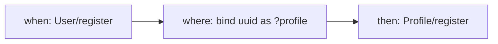

The user wants to explore a concept-lang 0.2.0 workspace visually. Produce three coordinated views: a two-layer overview, per-sync flow drill-downs, and a validator overlay. Explore is read-only and takes no arguments — it always renders the whole workspace.

## Step 1: Produce the top-level interactive explorer

Call `get_interactive_explorer`. This writes a self-contained HTML page to disk and returns the file path. Report the path to the user so they can open it. The explorer contains:

- A **two-layer graph view**: concepts are nodes, composition rules are labeled edges between concepts. Clicking an edge opens the source of the corresponding `.sync` file in a side panel. Clicking a node opens the source of the corresponding `.concept` file.
- **Per-concept state machine diagrams** (Mermaid `stateDiagram-v2`, one per concept)
- **Per-concept entity diagrams** (Mermaid `classDiagram`, sets as classes, relations as associations, one per concept)
- **Action-to-rule tracing**: clicking an action in a concept highlights every composition rule that triggers or is triggered by it.

## Step 2: Produce the workspace graph as inline Mermaid

In addition to the HTML explorer, render the workspace graph directly in the chat so the user can see it without opening a file. Call `get_workspace_graph`, which returns a Mermaid `graph TD` string where nodes are concepts and edges are composition rules labeled with the rule name. Paste it into a fenced Mermaid code block so the chat UI renders it.

## Step 3: Per-rule flow drill-downs

For each composition rule in the workspace (get the list with `list_syncs`), call `read_sync(name=<rule>)` and produce a small per-rule Mermaid diagram that shows the `when -> where -> then` flow. Example shape:

If a rule has multiple `when` clauses, fan them in; if it has multiple `then` clauses, fan them out. If there is no `where` clause, omit that node. This is a hand-rolled render from the `SyncAST` fields in the `read_sync` response — there is no dedicated MCP tool for it. The rendering logic is:

- For each `when` pattern, a node labeled `when: <Concept>/<action>`
- If `where` is non-empty, a single node labeled `where: <compact description>` (list all queries and binds, truncate to 60 chars)
- For each `then` pattern, a node labeled `then: <Concept>/<action>`
- Directed edges from every `when` to the `where` node (if present) or directly to every `then`
- Directed edges from the `where` node to every `then`

Produce one diagram per rule and keep each small (under 10 nodes). If a rule is so large it would exceed the limit, render only the first few `then` clauses and note "...and N more then clauses" below the diagram.

## Step 4: Rule-violations overlay

Call `validate_workspace`. For every diagnostic in the response with severity `error`, mark the offending file in the overview — the user should be able to see at a glance which concepts and composition rules fail validation.

The overlay is a one-shot text render, not an interactive HTML update: print a section titled **Validation overlay** with two sub-lists:

- **Concepts with errors** — `<ConceptName>`: `<codes>` (one per error, comma-joined)
- **Composition rules with errors** — `<RuleName>`: `<codes>`

If there are no errors, print "All files validate cleanly."

If a concept or rule appears in the overlay, also rerun `read_concept` / `read_sync` on it and offer to print the source so the user can see the offending region. Do not print the source unsolicited — just offer.

## Step 5: Per-concept diagrams on request

For every concept in the workspace, the interactive explorer already has the state-machine and entity diagram rendered. If the user wants a specific one in the chat (to screenshot or to read without opening the HTML), call `get_state_machine(name=<Concept>)` or `get_entity_diagram(name=<Concept>)` and paste the Mermaid string directly.

## Step 6: Final summary

End the output with:

1. **How many concepts, how many composition rules, how many diagnostics** (counts)
2. **Legibility rating** — a quick heuristic pass over the three legibility properties from Daniel Jackson's paper (incrementality, integrity, transparency), rendered as traffic-light markers (green / yellow / red) with a one-sentence justification each. See the `/concept-lang:review` skill for the deep version.
3. **Next steps** — a pointer to `/concept-lang:review` for a full review, `/concept-lang:build` to add a concept, or `/concept-lang:build-sync` to add a composition rule.

## What NOT to do

- Do not call the deprecated dependency-graph alias. Use `get_workspace_graph` instead — the old alias is scheduled for removal.
- Do not list any app-spec tool in frontmatter.
- Do not try to render the two-layer graph by hand — the HTML explorer and `get_workspace_graph` already do it, and duplicating the rendering logic in the skill body is a maintenance trap.
- Do not modify any concept or composition rule file — `explore` is read-only.
